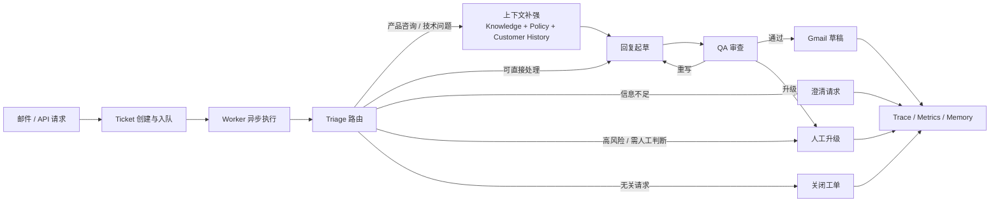

# 智能邮件工单引擎

一个面向真实邮件客服场景的 Agent 工单后端。

这个项目不是“自动回一封邮件”的脚本，而是一套以 `Ticket` 为中心、由 `Worker` 异步驱动、用 `LangGraph` 编排的客服处理系统。它接收 Gmail 邮件或业务 API 请求，将客户问题转入统一工单流转，完成意图识别、任务路由、上下文补强、回复起草、质量审查、人工升级、长期记忆沉淀，以及基于 trace 的评估观测。

## 项目简介

面向真实邮件客服场景，客户请求往往会混合产品咨询、故障排查、退款计费和反馈等多类问题。这个项目围绕“消息如何被稳定地处理成一张工单”展开，独立实现了一套以 `Ticket` 为中心、由 `Worker` 异步执行的 Agent 客服后端。

项目重点不在单次生成效果，而在完整闭环：

- 输入先工单化，而不是直接进入模型调用
- 执行由 `API 入队 + Worker 消费` 完成，而不是同步阻塞请求
- 工作流中同时存在知识检索、规则约束、草稿生成、QA 重写和人工升级
- 结果不只是一段回复，还包括澄清请求、人工接管、关闭工单和记忆更新
- 每次运行都会沉淀 trace、metrics、质量评估和轨迹评估

## 核心流程



## 技术栈

`Python` · `LangChain` · `LangGraph` · `RAG` · `FastAPI` · `Postgres` · `Chroma` · `LangSmith`

## 设计模块

### 1. 意图识别与任务路由

项目设计了一套邮件 `triage` 体系，将请求归入多类主路由，并结合规则与结构化 LLM 输出共同判断优先级、是否需要澄清、是否需要升级。

这一层解决的不是“怎么回答”，而是“这类问题应该进入哪条处理链路”：

- 区分产品知识咨询、技术问题、商业政策请求、反馈类请求和无关请求
- 在主路由之外补充优先级、风险标签和升级信号
- 把“信息不足”和“高风险场景”提前从回复链路中分流出去

### 2. 多 Agent 与节点编排

系统基于 `LangGraph` 拆分出 `Triage / Knowledge / Drafting / QA & Handoff` 等能力节点，不把所有判断压进一个 Prompt。

整个流程不是单链路调用，而是显式工作流：

- `Triage` 负责理解问题并决定第一跳
- `Knowledge / Policy / Customer History` 负责补强上下文
- `Drafting` 负责生成回复草稿
- `QA & Handoff` 负责质量审查、重写与人工升级决策

这让系统既保留了 LLM 的生成能力，也保留了流程上的可控性。

### 3. 长期记忆提取与融合

在工单收尾阶段，系统会从本次处理过程中提取并融合风险标签、业务标记、历史案例等信息，更新客户长期记忆，用于后续请求中的画像补充与风险判断。

这里的重点不是做一个聊天记忆 Demo，而是把记忆作为客服系统中的业务资产来使用：

- 为后续请求补充客户背景
- 记录历史处理特征和业务风险
- 在规则判断和人工升级时提供额外上下文

### 4. Trace 追踪与评估观测

项目构建了按单次工单记录的可观测体系，围绕每次 run 输出 trace、延迟、资源消耗、轨迹评估，并结合 `LLM-as-a-Judge` 对最终草稿进行质量判断。

这部分能力让项目不只是“能跑”，而是“能回看、能分析、能迭代”：

- 可以查看一次工单为何走到某条路径
- 可以观察执行耗时、资源消耗和节点行为
- 可以评估回复质量与执行轨迹是否符合预期

### 5. 可恢复执行机制

整个系统采用 `API 入队 + Worker 异步执行` 的运行模型，引入租约、续租、checkpoint 恢复和 Gmail 草稿幂等等机制，以提升长流程运行可靠性。

这里体现的是工程化执行能力，而不是单次推理能力：

- API 只负责接收请求和入队
- Worker 负责 claim run、续租 lease、执行 workflow
- 失败后可以围绕 checkpoint 恢复，而不是整条流程重来

## 项目结果

项目完成了邮件客服 AI 应用的完整闭环，覆盖了从请求接入、工单流转、回复生成到人工协同、观测评估和记忆更新的一整套后端能力。

在自建测试样本中：

- 主路由准确率 `98.4%`
- 升级判断准确率 `95.2%`
- 平均回复质量 `4.51 / 5`
- 平均轨迹评分 `4.71 / 5`

## 系统结构

| 模块 | 作用 |
| --- | --- |
| `src/api/` | FastAPI 应用、路由、schema、服务层 |
| `src/orchestration/` | LangGraph workflow、route map、checkpointing |
| `src/workers/` | worker loop、run claim、lease、执行入口 |
| `src/tickets/` | ticket 状态机、message log、生命周期管理 |
| `src/agents/`, `src/triage/`, `src/llm/`, `src/rag/` | 模型、路由、知识与策略能力 |
| `src/memory/`, `src/evaluation/`, `src/telemetry/` | 长期记忆、评估、trace 与可观测性 |
| `src/tools/` | Gmail、policy provider、ticket store 等适配层 |

## 快速启动

环境要求：

- Python `3.10+`
- `Postgres`
- `MY_EMAIL`
- `LLM_API_KEY`

初始化：

```powershell
python -m venv .venv
.venv\Scripts\activate
pip install -r requirements.txt
Copy-Item .env.example .env
python scripts/init_db.py
python scripts/build_index.py
```

启动核心服务：

```powershell
python serve_api.py
python run_worker.py
```

如需 Gmail 自动摄入：

```powershell
python run_poller.py
```

## 演示路径

1. 启动 `API` 和 `Worker`
2. 调用 `POST /tickets/ingest-email`
3. 调用 `POST /tickets/{ticket_id}/run`
4. 查看 `GET /tickets/{ticket_id}`
5. 查看 `GET /tickets/{ticket_id}/trace`

## API 概览

| 类型 | 接口 |
| --- | --- |
| `接入 / 执行` | `POST /tickets/ingest-email`, `POST /tickets/{ticket_id}/run` |
| `人工动作` | `POST /tickets/{ticket_id}/approve`, `POST /tickets/{ticket_id}/edit-and-approve`, `POST /tickets/{ticket_id}/rewrite`, `POST /tickets/{ticket_id}/escalate`, `POST /tickets/{ticket_id}/close` |
| `查询` | `GET /tickets/{ticket_id}`, `GET /tickets/{ticket_id}/trace`, `GET /customers/{customer_id}/memory`, `GET /metrics/summary` |

## 文档

- `docs/customer-support-copilot-technical-design.zh-CN.md`
- `docs/customer-support-copilot-requirements.zh-CN.md`
- `docs/specs/`
- `evals/README.zh-CN.md`
