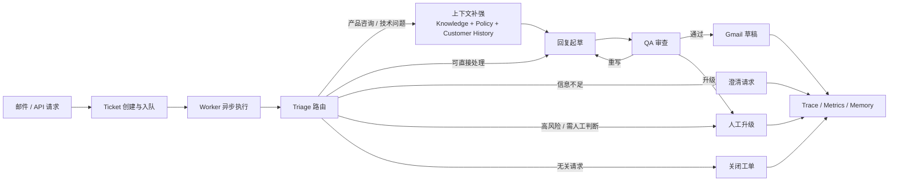

# 智能邮件工单引擎

一个面向真实邮件客服场景的“前端控制台 + 控制面 API + Worker 编排”系统。

这个项目不是“自动回一封邮件”的脚本，而是一套以 `Ticket` 为中心、由 `API 入队 + Worker 异步执行` 驱动的客服处理系统。它接收 Gmail 邮件或业务 API 请求，把客户问题沉淀成工单，并围绕意图路由、知识补强、回复起草、QA 审查、人工动作、trace 观测和长期记忆形成完整闭环。

## 当前状态

- 控制面最小闭环 M1 已完成：`GET /tickets`、`GET /tickets/{ticket_id}/runs`、`GET /tickets/{ticket_id}/drafts`、`POST /ops/gmail/scan-preview`、`POST /ops/gmail/scan`、`GET /ops/status`、`POST /dev/test-email`、`POST /tickets/{ticket_id}/retry` 已落地。
- 控制台最小可演示版本 M2 已完成：Dashboard、Tickets、Ticket Detail、Trace & Eval、Gmail Ops、Test Lab 已接入真实控制面数据，其中原 `System Status` 信息已并入 Dashboard。
- 前端工程位于 `frontend/`，支持独立开发、测试、构建和静态部署。
- 当前仓库已经具备“可部署”条件，但更适合内网或受控环境。若要直接公网生产使用，仍应补齐认证、访问控制、TLS、反向代理、进程托管和密钥管理。

## 核心流程



## 技术栈

`Python` · `FastAPI` · `LangChain` · `LangGraph` · `Postgres` · `Chroma` · `LangSmith` · `React` · `TypeScript` · `Vite` · `React Query` · `Zustand`

## 核心能力

### 1. 工单化接入与异步执行

- 输入先进入 `Ticket` 体系，而不是直接阻塞在单次模型调用上。
- API 负责创建工单和入队，Worker 负责 claim run、续租 lease、执行 workflow。
- 失败后支持围绕 checkpoint 恢复，而不是简单整条重跑。

### 2. 路由、知识与生成分层

- `Triage` 负责主路由、风险信号和升级判断。
- `Knowledge / Policy / Customer History` 负责上下文补强。
- `Drafting / QA & Handoff` 负责草稿生成、质量审查、重写和人工升级决策。

### 3. 控制台与控制面

- `frontend/` 提供独立的操作台界面。
- `src/api/` 提供 Ticket 列表、详情、run history、draft history、trace、metrics、ops status、Gmail Ops、Test Lab 等控制面接口。
- 人工动作已集成到 Ticket Detail 页面，通过控制面接口触发审批、编辑审批、重写、升级和关闭。

### 4. 观测与评估

- 每次 run 都会沉淀 trace、延迟、资源消耗、响应质量和轨迹评估。
- 前端 `Trace & Eval` 页面可直接查看时间线、事件台账、指标对比和 raw drawer。

### 5. Gmail 与测试注入

- 支持 Gmail 扫描预览、实际扫描摄入和可选入队。
- 支持 `POST /dev/test-email` 进行测试邮件注入，便于演示、联调和回归验证。

## 控制台页面

- `Dashboard`: 读取 `ops/status`、`metrics/summary` 和 `tickets` 的综合态势页。
- `Tickets`: Ticket 列表、筛选、分页和详情跳转。
- `Ticket Detail`: snapshot、runs、drafts 与人工动作工作台。
- `Trace & Eval`: run 时间线、事件台账、指标对比与 raw payload。
- `Gmail Ops`: scan-preview、scan 与 mailbox posture。
- `Test Lab`: 测试邮件注入与 ticket/trace 跳转。
- `Dashboard` 内含可靠性摘要：worker、依赖、队列和失败交接信号。

## 系统结构

| 路径 | 作用 |
| --- | --- |
| `frontend/` | React 控制台前端，包含路由、页面、typed API client、查询层与页面测试 |
| `src/api/` | FastAPI 应用、路由、schema、服务层 |
| `src/orchestration/` | LangGraph workflow、route map、checkpointing |
| `src/workers/` | worker loop、run claim、lease、执行入口 |
| `src/tickets/` | ticket 状态机、message log、生命周期管理 |
| `src/agents/`, `src/triage/`, `src/llm/`, `src/rag/` | 模型、路由、知识与策略能力 |
| `src/memory/`, `src/evaluation/`, `src/telemetry/` | 长期记忆、评估、trace 与可观测性 |
| `src/tools/` | Gmail、policy provider、ticket store 等适配层 |

## 快速启动

### 环境要求

- Python `3.10+`
- Node.js `18+`
- `Postgres`
- `MY_EMAIL`
- `LLM_API_KEY`
- 构建知识库索引时还需要 `EMBEDDING_API_URL` 与 `EMBEDDING_MODEL`

如果当前不需要 live Gmail，可在 `.env` 中设置 `GMAIL_ENABLED=false`。
如果当前不希望启用回复质量 LLM Judge，可在 `.env` 中设置 `LLM_JUDGE_ENABLED=false`。

### 后端初始化

```powershell
python -m venv .venv
.venv\Scripts\activate
pip install -r requirements.txt
Copy-Item .env.example .env
python scripts/init_db.py
python scripts/build_index.py
```

### 启动后端服务

```powershell
python serve_api.py
python run_worker.py
```

如需 Gmail 自动摄入，再额外启动：

```powershell
python run_poller.py
```

### 启动前端控制台

```powershell
cd frontend
npm install
Copy-Item .env.example .env
npm run dev
```

前端默认读取 `http://127.0.0.1:8000`，如需改后端地址，请修改 `frontend/.env`：

```bash
VITE_API_BASE_URL=http://127.0.0.1:8000
```

### 本地演示路径

1. 启动 `API` 和 `Worker`
2. 打开前端控制台
3. 在 `Test Lab` 注入一封测试邮件
4. 在 `Tickets` 或 `Ticket Detail` 查看工单与草稿状态
5. 在 `Trace & Eval` 查看 run 时间线和评估结果

## 部署与使用边界

当前仓库适合“前后端分离 + Worker 独立进程”的受控部署模式。最小可用部署通常至少包含：

- 一份静态前端构建产物
- 一个 FastAPI API 进程
- 一个 Worker 进程
- 一个 Postgres 实例
- 一份已构建的知识库索引 `.artifacts/knowledge_db`
- 可选 Gmail poller 进程

部署前请注意：

- 前端部署到独立域名时，需要设置 `VITE_API_BASE_URL` 指向 API 域名。
- 后端需要设置 `CORS_ALLOW_ORIGINS`，不要在生产环境继续使用默认的 `*`。
- `X-Actor-Id` 只用于标记人工动作发起人，不等于真正的认证系统。
- 没有内建登录、会话或权限边界时，不建议把 API 和控制台直接裸露到公网。

前后端分离的生产部署清单见 [docs/frontend-backend-production-deployment-checklist.zh-CN.md](docs/frontend-backend-production-deployment-checklist.zh-CN.md)。

## API 概览

| 类型 | 接口 |
| --- | --- |
| `接入 / 执行` | `POST /tickets/ingest-email`, `POST /tickets/{ticket_id}/run`, `POST /tickets/{ticket_id}/retry` |
| `列表 / 详情` | `GET /tickets`, `GET /tickets/{ticket_id}`, `GET /tickets/{ticket_id}/runs`, `GET /tickets/{ticket_id}/drafts` |
| `人工动作` | `POST /tickets/{ticket_id}/drafts/save`, `POST /tickets/{ticket_id}/approve`, `POST /tickets/{ticket_id}/edit-and-approve`, `POST /tickets/{ticket_id}/rewrite`, `POST /tickets/{ticket_id}/escalate`, `POST /tickets/{ticket_id}/close` |
| `观测` | `GET /tickets/{ticket_id}/trace`, `GET /metrics/summary`, `GET /ops/status` |
| `Gmail Ops` | `POST /ops/gmail/scan-preview`, `POST /ops/gmail/scan` |
| `开发 / 测试` | `POST /dev/test-email`, `GET /customers/{customer_id}/memory` |

## 文档

- [docs/customer-support-copilot-technical-design.zh-CN.md](docs/customer-support-copilot-technical-design.zh-CN.md)
- [docs/customer-support-copilot-requirements.zh-CN.md](docs/customer-support-copilot-requirements.zh-CN.md)
- [docs/frontend-control-plane-design.zh-CN.md](docs/frontend-control-plane-design.zh-CN.md)
- [docs/frontend-information-architecture.zh-CN.md](docs/frontend-information-architecture.zh-CN.md)
- [docs/frontend-control-plane-implementation-plan.zh-CN.md](docs/frontend-control-plane-implementation-plan.zh-CN.md)
- [docs/frontend-backend-production-deployment-checklist.zh-CN.md](docs/frontend-backend-production-deployment-checklist.zh-CN.md)
- `docs/specs/`
- [evals/README.zh-CN.md](evals/README.zh-CN.md)
