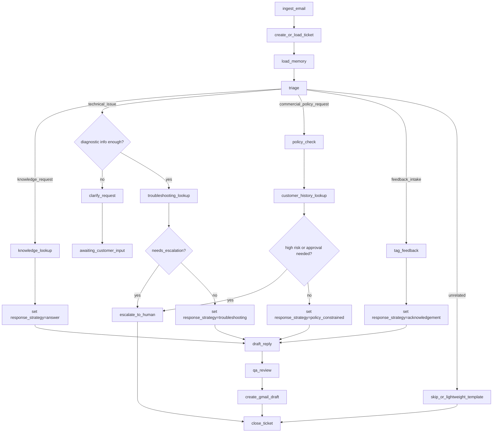
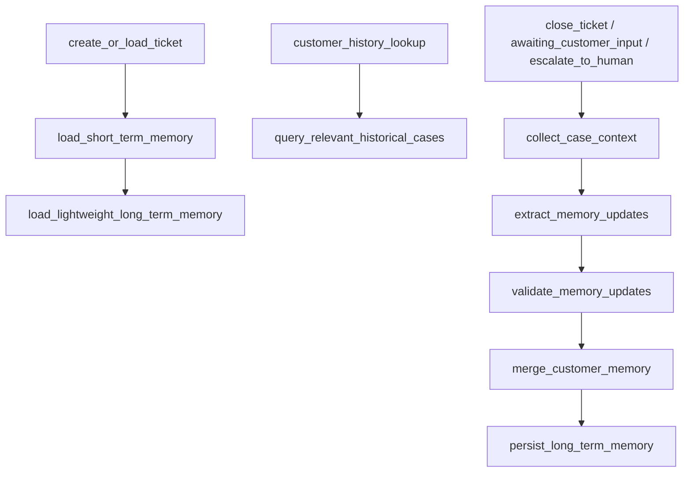

# Customer Support Copilot 扩展需求文档

## 1. 文档目的

本文档用于把当前仓库 `langgraph-email-automation` 从“可运行的邮件自动化示例”升级为“适合面试深聊的个人项目”。

这份文档同时回答四个问题：

1. 当前仓库到底已经做到了什么。
2. 当前仓库缺了什么，因此为什么还不够像一个完整系统。
3. 扩展后的目标项目应该长什么样。
4. 做到什么程度，才算一个足够强的面试项目。

本文档默认读者是：

1. 项目作者本人。
2. 面试官。
3. 后续维护者。

写作原则：

1. 尽量用业务语言解释系统。
2. 不要求读者先读代码。
3. 明确区分“当前实现”和“目标能力”。
4. 保留真实场景，但把项目讲成一个完整系统，而不是脚本 Demo。

---

## 2. 当前项目概览

### 2.1 当前项目是什么

当前仓库本质上是一个 Gmail 驱动的客服邮件自动化流程。系统会读取最近 8 小时内的邮件，筛掉自己发出的邮件和已经存在草稿回复的线程，然后用 LangGraph 编排一条处理链路：

1. 拉取邮件。
2. 判断是否还有邮件待处理。
3. 对当前邮件做分类。
4. 如果是产品咨询，则先构造 RAG 查询，再从本地向量库检索。
5. 根据分类结果和检索结果生成草稿。
6. 用 proofreader 节点检查草稿是否可发送。
7. 如果不合格，则回到 writer 重新生成，最多三轮。
8. 如果合格，则把回复写入 Gmail 草稿。

### 2.2 当前项目已经具备的价值

当前项目已经有几个很重要的优点，这也是它适合继续扩展的原因：

1. 有真实业务入口，不是纯本地对话机器人。
2. 有真实外部系统集成，接了 Gmail API。
3. 有 LangGraph 条件边和循环，不只是单链调用。
4. 已经有分类、检索、生成、审核闭环。
5. 已经有最基础的“多角色分工”雏形。

### 2.3 当前项目还不够强的地方

如果直接拿当前仓库去面试，通常可以讲 5 到 10 分钟，但很难支撑更深入的问题。主要原因不是它不能运行，而是它更像一个流程样例，而不是一个具备系统边界、状态设计、可观测性和可演进性的完整项目。

核心不足如下：

1. 意图识别只有四分类，表达能力偏弱。
2. 没有真正的路由层或 supervisor。
3. 没有短期记忆和长期记忆分层。
4. 没有人工审核闭环，只是写 Gmail 草稿。
5. 没有正式的评估体系。
6. 没有基于 trace 的核心评估体系，无法稳定观测延迟、资源、响应质量和执行轨迹。
7. 没有任务持久化、失败恢复和幂等设计。
8. 没有把“知识库”和“客户记忆”分清楚。

---

## 3. 目标项目定位

### 3.1 推荐项目名称

建议从“邮件自动化”升级为以下任一定位：

1. `Customer Support Copilot`
2. `Agentic Support Triage System`
3. `Email-first Customer Support Copilot`

### 3.2 推荐的一句话介绍

这是一个基于 `LangGraph + LangChain` 的多 Agent 客服协同系统，以邮件作为主要入口，支持意图识别、任务路由、知识检索、客户记忆、草稿生成、质量审查、人工升级和评估观测。

### 3.3 为什么保留邮件场景

保留邮件场景是有必要的，不应该为了“包装成 Agent 项目”而把邮件背景拿掉。

原因有四点：

1. 邮件是非常真实的客服入口，业务合理性强。
2. Gmail 是真实外部系统，能证明项目不是自娱自乐的本地 Demo。
3. 邮件天然承载意图识别、升级处理、人工审核、知识问答这些能力。
4. 邮件只是第一个渠道，系统设计上仍然可以扩展到 Web Chat、工单系统或企业 IM。

因此，项目背景仍然是“邮件客服”，但项目层级要升级为“以邮件为入口的客服协同系统”。

---

## 4. 项目要解决的问题

### 4.1 业务问题

一个中小型 SaaS 团队在客服邮件处理中通常会遇到以下问题：

1. 产品咨询、投诉、反馈、退款请求混在同一个邮箱。
2. 客服人员需要反复回答相似问题。
3. 回复质量依赖个人经验，不够稳定。
4. 复杂邮件容易误判，尤其是多意图、高风险、模糊意图场景。
5. ~~客户重复发邮件时，客服不一定知道历史背景。~~

### 4.2 项目目标

扩展后的系统要同时满足业务目标和技术目标。

业务目标：

1. 减少客服重复劳动。
2. 缩短首次响应时间。
3. 提高回复一致性、准确性和稳妥性。
4. 在高风险场景中优先选择人工升级，而不是自动乱答。
5. 对客户历史上下文形成连续性。

技术目标：

1. 让 LangGraph 真正承担状态编排职责，而不是只串几个链。
2. 引入明确的意图路由和多 Agent 分工。
3. 区分短期记忆和长期记忆。
4. 保持当前 RAG 可运行，并为未来 `RAG MCP` 插件化接入预留接口。
5. 建立基于 trace 的评估与观测体系，核心关注延迟、资源、响应质量和轨迹评估。
6. 支持面试时对架构、流程、状态、指标、异常处理做深入说明。

---

## 5. 用户与角色

### 5.1 外部客户

外部客户通过邮件提交问题、投诉、建议或退款请求。他们关心的是：

1. 回复是否及时。
2. 回复是否真的解决问题。
3. 是否需要反复重复背景信息。

### 5.2 客服专员

客服专员希望系统帮他完成：

1. 邮件初筛。
2. 意图识别和优先级判断。
3. 知识检索和历史信息整理。
4. 草稿自动生成。
5. 高风险邮件的升级判断。

### 5.3 支持主管或运营负责人

负责人希望系统能够回答以下管理问题：

1. 自动化到底节省了多少时间。
2. 哪类邮件最容易失败。
3. 哪些邮件一定要人工介入。
4. 模型是否存在明显误答或流程偏差。

### 5.4 项目作者本人

作为面试项目作者，你最需要的是：

1. 这个项目必须有真实场景。
2. 这个项目必须有技术深度。
3. 这个项目必须能解释清楚，不依赖“看代码才懂”。
4. 这个项目必须能被面试官追问 20 分钟以上。

---

## 6. 范围与边界

### 6.1 V1 必须实现的范围

1. 保留 Gmail 作为当前主入口。
2. 保留当前本地 RAG 实现，不重写 RAG 主体能力。
3. 引入更细粒度的意图识别和路由。
4. 引入最小可解释的多 Agent 角色分工，首版控制在 4 个核心 Agent 左右。
5. 引入短期记忆与长期记忆。
6. 引入人工审核与人工升级节点。
7. 引入基于 trace 的评估与观测能力。
8. 保留当前“生成 Gmail 草稿”的模式，而不是直接自动发送。
9. 引入最小工具层，用于承载 Gmail、工单状态和知识访问等外部能力。

### 6.2 V2 建议扩展的范围

1. 完善人工审核动作与自动流程并发更新同一工单时的冲突控制与恢复策略。
2. 通过 `RAG MCP` 插件接入外部知识库。
3. 增加更多业务规则，例如优先级、SLA、客户等级。
4. 支持更多入口渠道，例如 Web 表单或工单系统。
5. 建立轻量控制台或 trace 查询页面。
6. 支持邮件图片附件的最小多模态处理，但不改变文本优先的意图识别机制。

### 6.3 当前阶段明确不做的范围

1. 不做复杂 CRM。
2. 不做完整客服中台。
3. 不做多模态输入重构。
4. 不在本轮重写 RAG 检索质量优化。
5. 不把系统包装成“全自动发送系统”。
6. 不对邮件中的图片附件做内容理解，图片中的关键信息暂不进入自动判断主流程。
7. 不在 V1 中实现复杂的人工审核后台、权限体系或多角色协作台。

---

## 7. 系统能力总览

本节从“能力视角”描述扩展后的目标系统应当具备什么能力：

1. 邮件接入层。
2. 意图识别与路由层。
3. 多 Agent 协作层。
4. 知识访问层。
5. 短期与长期记忆层。
6. 草稿生成与改写层。
7. 人工审核与升级层。
8. 观测与评估层。

这八层能力的关系不是并列堆砌，而是主流程中连续发生的：

1. 先接入邮件并形成工单上下文。
2. 再识别意图并决定路由。
3. 再决定是否需要知识、策略、人工审核。
4. 最后形成草稿，并对过程和结果做评估。

从“系统实现视角”看，上述八层能力通常会收敛到七层系统分层：

1. 渠道接入层。
2. 工单与状态层。
3. LangGraph 编排层。
4. Agent 能力层。
5. 工具层。
6. 知识与记忆层。
7. 观测与评估层。

两种视角的关系可以简单理解为：

1. 邮件接入层，对应渠道接入层。
2. 意图识别与路由层、多 Agent 协作层、草稿生成与改写层、人工审核与升级层，主要落在 LangGraph 编排层加 Agent 能力层。
3. Gmail 草稿创建、工单读写、知识访问、政策查询等外部能力，通过最小工具层统一暴露。
4. 知识访问层、短期与长期记忆层，对应知识与记忆层。
5. 观测与评估层，对应观测与评估层。
6. 所有能力的状态承载、并发控制、幂等与恢复，统一落在工单与状态层。

因此，这份需求文档保留“八层能力”写法，用来说明系统要做什么；技术设计文档使用“七层分层”写法，用来说明系统怎么落地。

---

## 8. 详细需求

## 8.1 邮件接入与工单化

### 8.1.1 目标

把“收件箱里的邮件”变成“系统内部可追踪的工单任务”。

### 8.1.2 必须具备的能力

1. 拉取未处理邮件。
2. 过滤自己发出的邮件。
3. 过滤已经存在草稿回复的线程。
4. 为每个待处理线程生成唯一工单上下文。
5. 记录处理状态，避免重复处理。

### 8.1.3 当前实现基础

当前仓库已经具备：

1. 拉取近 8 小时邮件。
2. 排除自己发出的邮件。
3. 排除已有 Gmail draft 的线程。
4. 以线程为单位去重。

### 8.1.4 目标升级点

需要从“靠 Gmail 当前状态推断是否处理过”，升级为“系统内部也有任务状态”。

建议状态至少包括：

1. `new`
2. `triaged`
3. `draft_created`
4. `awaiting_human_review`
5. `approved`
6. `rejected`
7. `escalated`
8. `failed`
9. `closed`

### 8.1.5 验收标准

1. 同一邮件线程不会反复生成多个草稿。
2. 系统重启后仍能知道哪些工单已处理到什么阶段。
3. 某个工单失败不会阻塞全部邮件处理。

### 8.1.6 下一版本中的图片附件支持

当前版本只处理邮件正文文本，不对图片附件做内容理解。

如果客户邮件包含图片，但关键信息未在正文中体现，则系统不基于图片直接做判断，而是进入补充信息请求或人工升级路径。

下一版本的图片附件支持按最小可用原则扩展，约束如下：

1. `Triage Agent` 仍然只基于纯文本做意图识别和路由。
2. 邮件接入层只负责提取图片附件并写入状态，不引入独立 OCR 或图片预处理流水线。
3. 图片只作为后续处理证据，由 `Knowledge & Policy Agent` 按需通过多模态模型读取。
4. `Drafting Agent` 默认不直接读取图片，而是消费上游结构化结论。
5. `QA & Handoff Agent` 仅在高风险场景或草稿明确引用图片证据时，再按需复核图片。
6. 如果正文和图片综合后仍然证据不足，系统应优先进入 `clarify_request` 或人工升级，而不是直接给出高置信度回复。

---

## 8.2 意图识别与任务路由

### 8.2.1 目标

把当前“四分类”升级为“主路由优先、标签补充”的可解释 triage 体系。

### 8.2.2 压缩后的意图分类体系

#### A. 主路由分类

首版建议把一级分类压缩为以下 5 条主路由：

1. `knowledge_request`
   用于处理“怎么用、是否支持、能力边界是什么”这类知识咨询。
2. `technical_issue`
   用于处理“报错、失败、异常、不可用”这类技术故障。
3. `commercial_policy_request`
   用于处理“计费、账单、退款、取消、补偿、SLA 承诺”这类商业或政策请求。
4. `feedback_intake`
   用于处理“投诉、功能建议、一般反馈”这类以接收意见和沉淀内部动作为主的请求。
5. `unrelated`
   用于处理垃圾邮件、推销、招聘、合作邀约等无关内容。

这里要明确四条约束：

1. 每封邮件只能有一个 `primary_route`。
2. 只有会触发不同执行路径的类别，才保留为一级主路由。
3. 语义细分但执行路径相同的类别，不再保留为一级分类。
4. “模糊意图”“多意图邮件”不再作为主分类，而是改成路由标签。

#### B. 辅助标签

除了主路由，Triage 还应输出以下标签：

1. `feature_request`
2. `complaint`
3. `general_feedback`
4. `billing_question`
5. `refund_request`
6. `multi_intent`
7. `needs_clarification`
8. `needs_escalation`

#### C. 判定原则

为了让分类结果可复现，首版至少遵循以下判定原则：

1. 主路由按“这封邮件下一步应该走哪条处理链路”来定，而不是按关键词数量来定。
2. 用户主要在问“怎么用”“是否支持”“能力边界是什么”时，归入 `knowledge_request`。
3. 用户已经尝试操作且出现报错、失败、不可用时，优先归入 `technical_issue`。
4. 用户涉及账单解释、收费规则、退款、取消订阅、补偿或 SLA 承诺时，优先归入 `commercial_policy_request`。
5. 用户主要在表达意见、抱怨、体验评价或功能建议，且核心目标不是立即获取知识答案、排查故障或触发商业政策动作时，归入 `feedback_intake`。
6. 技术故障场景下，如果系统判断诊断信息不足，不改变主路由，保留 `technical_issue`，并将 `needs_clarification` 设为 `true`。
7. 一封邮件同时包含两个及以上明确业务诉求时，将 `multi_intent` 设为 `true`；如果跨越多条主路由，可补充 `secondary_routes`。

#### D. 典型边界示例

1. “请问专业版支持 SSO 吗？”应归入 `knowledge_request`。
2. “我按文档配置了 SSO，但一直登录失败。”应归入 `technical_issue`。
3. “为什么本月账单比上月高？”应归入 `commercial_policy_request`，并加标签 `billing_question`。
4. “请退回这次扣款并取消续费。”应归入 `commercial_policy_request`，并加标签 `refund_request`。
5. “新版报表不好用，建议增加地区筛选。”应归入 `feedback_intake`，并加标签 `feature_request`，必要时补充 `complaint`。

#### E. 技术故障的澄清分流规则

只有在系统判断技术故障信息不足时，才触发澄清分流。

最小触发条件至少包括以下任一情况：

1. 用户没有描述复现步骤。
2. 用户没有提供实际报错信息或异常现象。
3. 用户没有说明期望结果与实际结果的差异。
4. 用户没有提供足以定位问题的环境或账号上下文。

一旦触发该分流，系统应：

1. 保持 `primary_route = technical_issue`。
2. 设置 `needs_clarification = true`。
3. 生成一封补充信息请求草稿，而不是直接尝试给出完整解决方案。
4. 工单进入 `awaiting_customer_input` 或等价状态。

技术故障的独立澄清模板见：

`docs/technical-issue-clarification-template.zh-CN.md`

### 8.2.3 输出要求

Triage 阶段不应只输出一个标签，还应输出结构化结果：

1. `primary_route`：必须来自上面的 5 条主路由之一。
2. `secondary_routes`：来自同一套路由集合，可为空。
3. `tags`：从辅助标签集合中取值，可为空。
4. `response_strategy`：建议首版固定为 `answer | troubleshooting | policy_constrained | acknowledgement`。
5. `multi_intent`：布尔值。
6. `intent_confidence`：0 到 1 之间的数值。
7. `priority`：建议首版固定为 `low | medium | high | critical`。
8. `needs_clarification`：布尔值。
9. `needs_escalation`：布尔值。
10. `routing_reason`：一句到两句可读理由。

### 8.2.4 为什么这是核心能力

因为很多后续节点都依赖路由结果：

1. 是否要检索知识库。
2. 是否要检查政策或退款规则。
3. 是否允许直接生成草稿。
4. 是否应该先问澄清问题。
5. 是否应升级人工。

### 8.2.5 验收标准

1. 每封邮件都能稳定落在 5 条主路由之一。
2. 相同执行路径的语义类别不再拆成多个一级分类。
3. 系统能解释为什么把邮件送去某条路径，并说明主路由与标签分别是什么。
4. 技术故障在信息不足时会分流到澄清节点，请求用户补充信息，不盲答。
5. 多意图邮件不会被粗暴压成单一路由，而是通过 `multi_intent + secondary_routes + tags` 表达。
6. “知识咨询 vs 技术故障”“商业政策请求 vs 技术故障”“反馈受理 vs 无关内容”这三组高混淆场景有明确判定规则，并能被样例验证。

---

## 8.3 多 Agent 协作

### 8.3.1 目标

系统要从“多个链串起来”升级为“多角色 Agent 协作系统”，但首版不追求把角色拆得越多越好，而是追求边界清晰、实现成本可控。

### 8.3.2 推荐 Agent 划分

首版推荐先收敛到以下 4 个核心 Agent：

1. `Triage Agent`
   负责分类、优先级、澄清、升级判断。
2. `Knowledge & Policy Agent`
   负责构造查询、检索知识，并处理退款、补偿、承诺边界、计费策略等规则判断。
3. `Drafting Agent`
   负责整合上下文并生成草稿。
4. `QA & Handoff Agent`
   负责检查草稿质量、事实性、逻辑性、风险性，并在需要时输出升级结论与升级说明。

如果后续复杂度继续增长，再考虑把上面两个复合角色拆开：

1. `Knowledge Agent` 与 `Policy Agent` 拆开。
2. `QA Agent` 与 `Escalation Agent` 拆开。

这样做的原因是：

1. 第一版最重要的是把路由、状态、记忆、并发控制和幂等做扎实。
2. 如果一开始就拆成 6 个 Agent，图会更复杂，但不一定带来实际收益。
3. 面试时也更容易解释“为什么先 4 个，什么时候再扩到 6 个”。

### 8.3.3 设计要求

1. 每个 Agent 职责要单一。
2. 每个 Agent 输入输出要结构化。
3. Agent 之间通过状态传递，不靠随意拼自然语言。
4. Agent 边界要能在面试时解释清楚。

### 8.3.4 验收标准

1. 面试官问“为什么不用一个大 Prompt”时可以清楚解释。
2. 每个 Agent 都能说明输入是什么、输出是什么、失败时怎么办。
3. 替换某个 Agent 不需要重写整条主流程。

### 8.3.5 与工具层的边界

首版项目建议增加最小工具层，但要控制边界：

1. Agent 负责判断、生成、审查，不直接持有高风险写操作。
2. Gmail 草稿创建、工单状态更新、外部副作用记录由编排层或节点通过工具层执行。
3. 知识访问和政策查询应通过统一接口暴露，而不是散落在各节点中。
4. 不要求第一版就支持通用 tool-calling 或复杂的 Agent 权限系统。

---

## 8.4 知识访问与 RAG

### 8.4.1 本轮原则

RAG 部分按当前实现保留，不在本轮进行重构。

这条原则必须明确，因为它决定了项目重心：

1. 当前阶段不重新设计检索索引。
2. 当前阶段不强制引入复杂 rerank、citation、chunk 元数据方案。
3. 当前阶段重点是路由、记忆、审核、观测和可解释性。

### 8.4.2 当前实现应被保留的能力

1. 使用 `agency.txt` 作为本地知识源。
2. 使用 Chroma 作为本地向量库。
3. 先生成查询，再执行检索问答。
4. 检索不足时返回“不知道”。

### 8.4.3 未来扩展接口

虽然当前不改 RAG，但系统必须预留以下能力：

1. 把知识访问抽象成统一接口。
2. 后续可通过 `RAG MCP` 作为插件接入外部知识库。
3. 主流程不因知识源切换而大改。

### 8.4.4 面试时应如何解释

推荐表述：

“我没有优先重写 RAG，因为这个项目的技术增量重点不在知识库本身，而在 Agent 路由、记忆分层、人工升级和评估观测。我保留了当前可运行的本地 RAG，并把未来外部知识接入抽象成 `RAG MCP` 插件接口，这样主流程能稳定，知识源可以后续替换。”

### 8.4.5 验收标准

1. 当前 RAG 功能保持可运行。
2. 知识访问层能够被抽象说明。
3. 知识缺失时系统不能胡编，应明确回答不知道或升级。

---

## 8.5 记忆体系

### 8.5.1 核心原则

必须把“知识库”和“记忆”分开。

知识库存的是通用业务知识。  
记忆存的是某个客户或某个工单的上下文。

### 8.5.2 短期记忆

短期记忆服务于当前工单或当前线程，建议存储：

1. 当前线程摘要。
2. 当前主意图和次意图。
3. 已经问过的澄清问题。
4. 已生成的草稿版本。
5. QA 审查意见。
6. 当前工单状态。
7. 当前节点进度。

### 8.5.3 长期记忆

长期记忆服务于跨工单连续性，建议存储：

1. 客户标识。
2. 客户名称或账号信息。
3. 历史问题类别分布。
4. 偏好语言或语气。
5. 是否曾有退款争议。
6. 是否为高价值客户。
7. 历史工单摘要。

### 8.5.4 设计要求

1. 短期记忆和长期记忆在概念上必须分离。
2. 两者在存储介质上最好也分离。
3. 读取策略必须不同，避免历史信息淹没当前问题。

### 8.5.5 触发与生命周期要求

1. 工单创建或加载后，应先加载短期记忆，再加载长期记忆。
2. 长期记忆首次加载时应优先读取轻量客户背景，例如客户画像、偏好语言、风险标签。
3. 只有在需要客户历史参与判断的节点，才应再次触发定向历史查询，例如退款争议、商业政策审批、风险判断。
4. 工单关闭、人工升级或进入等待客户补充前，应提炼本工单可沉淀的信息，生成记忆更新。
5. 短期记忆应覆盖整个工单生命周期，而不是只覆盖单次函数调用。
6. 工单关闭后，短期记忆可清理、归档或设置过期时间；长期记忆继续保留用于后续工单。

### 8.5.6 客户标识归并要求

1. 长期记忆必须绑定稳定 `customer_id`，不能只依赖临时运行态。
2. `customer_id` 可以由邮箱地址、账号 ID 或 CRM 主键归并得到，但规则必须稳定且可解释。
3. 如果同一客户存在多个邮箱地址或别名地址，系统应支持归并到同一客户。
4. 如果无法可靠识别客户，应回退为“仅使用当前工单短期记忆”，避免错误污染长期记忆。
5. 所有写入长期记忆的更新都应记录来源工单 `ticket_id`。

### 8.5.7 V2 记忆衰退与归档要求

这一部分属于 V2 增强能力，不要求在首版最小实现中一次完成。

1. 系统应区分长期记忆的三种后续处理方式：删除、降权、归档。
2. 删除用于错误提取、重复脏数据、隐私合规清理或客户明确要求删除的内容。
3. 降权用于可能过时但仍有参考价值的信息，例如偏好语言、偏好语气、旧历史案例。
4. 归档用于不应继续影响主流程、但需要保留审计或历史追溯价值的内容。
5. 稳定事实类信息，例如客户标识、账号主键，不应做自动时间衰退。
6. 风险标签、价值客户等高影响字段，不应简单按时间自动删除，必要时应支持人工确认或人工修正。
7. 历史工单摘要默认不需要立即删除，但应避免无限制进入当前上下文。

### 8.5.8 验收标准

1. 同一客户再次发邮件时，系统能引用历史背景。
2. 当前工单内的多轮信息不会丢失。
3. 面试时能够清楚回答“为什么知识库不是长期记忆”。
4. 能解释长期记忆何时预加载、何时按需查询、何时回写。
5. 能解释客户身份无法确认时为什么不能强行写入长期记忆。
6. 能解释删除、降权、归档分别在什么场景下使用。

---

## 8.6 草稿生成与改写

### 8.6.1 目标

让系统不仅能生成草稿，还能解释草稿为什么通过或失败。

### 8.6.2 必须具备的能力

1. 根据不同意图生成不同风格的回复。
2. 保存每一轮草稿。
3. 保存每一轮 QA 反馈。
4. 支持有限次改写。
5. 记录改写原因。

### 8.6.3 设计要求

1. 改写循环要有上限，防止死循环。
2. QA 反馈要结构化，不只是“这封邮件不太好”。
3. 必须能展示失败案例和修正过程。

### 8.6.4 验收标准

1. 可以展示第一版草稿为什么不通过。
2. 可以展示第二版或第三版如何改善。
3. 失败次数过多时，系统不应一直自动重试，应转入人工处理。

---

## 8.7 人工审核与升级

### 8.7.1 目标

本节能力属于 V1。V2 主要补充的是人工审核动作与自动流程并发更新同一工单时的冲突控制，而不是把人工审核本身推迟到下一版。

### 8.7.2 必须支持的场景

以下场景建议默认进入人工审核或人工升级：

1. 涉及退款金额。
2. 涉及补偿或 SLA 承诺。
3. 涉及安全事故或数据丢失。
4. 涉及法律、合同、政策解释。
5. 模型置信度低。
6. QA 多轮不通过。
7. 知识库证据不足。

### 8.7.3 人工可执行动作

1. 批准草稿。
2. 修改后批准。
3. 驳回并要求重写。
4. 升级给高级支持人员。

### 8.7.4 验收标准

1. 系统能解释为什么某封邮件必须人工接管。
2. 高风险工单不会进入“自动发送”。
3. 人工审核结果能被记录进工单状态。

---

## 8.8 观测与评估

### 8.8.1 目标与定位

本节定义系统的评估与观测要求。

该能力的主要目标是：

1. 支持运行观测、问题定位和版本回归对比。
2. 回答以下 4 个核心问题：
   `这次运行慢不慢`、`这次运行花了多少资源`、`最终回复质量好不好`、`这次执行路径对不对`。
3. 为面试展示、系统调试和后续优化提供稳定的量化依据。

该能力的系统定位是：

1. 评估层是旁路能力，不参与主流程决策。
2. 评估层不应阻塞工单执行，也不应改变图编排结果。
3. 所有评估结论都必须绑定到同一次运行的 `trace_id`。

### 8.8.2 范围与非目标

首版必须覆盖以下 4 类核心评估：

1. 延迟。
2. 资源。
3. 响应质量。
4. 轨迹评估。

首版明确不以以下事项为目标：

1. 不使用评估结果在线控制下一步流程。
2. 不将附加指标扩展成复杂的实时治理系统。
3. 不记录模型原始思维链，只记录可观测运行事件与结构化结论。

### 8.8.3 核心评估要求

#### A. 延迟评估

目的：

用于衡量单次运行的时间开销，并支持慢节点定位。

首版至少记录：

1. 端到端处理延迟。
2. 关键节点延迟。
3. 单次模型调用延迟。
4. 单次工具调用延迟。

#### B. 资源评估

目的：

用于衡量单次运行的资源消耗，并支持不同路径间的成本对比。

首版至少记录：

1. 每次模型调用输入 token 数。
2. 每次模型调用输出 token 数。
3. 单次运行总 token 消耗。
4. 模型调用次数。
5. 工具调用次数。

#### C. 响应质量评估

目的：

用于评估最终回复是否满足业务预期。

首版至少覆盖以下维度：

1. 相关性。
2. 正确性。
3. 意图一致性。
4. 表达清晰度。

#### D. 轨迹评估

目的：

用于评估系统是否沿正确路径完成任务，而不是只看最终结果是否看起来可接受。

首版至少覆盖以下维度：

1. 路由是否正确。
2. 节点顺序是否合理。
3. 关键步骤是否缺失。
4. 该转人工时是否正确转人工。

### 8.8.4 Trace 追踪要求

系统必须满足以下 trace 要求：

1. 每次 run 必须生成唯一 `trace_id`。
2. Trace 至少记录 4 类事件：节点事件、模型调用事件、工具调用事件、关键决策事件。
3. 关键决策事件至少包括：路由结果、是否需要澄清、是否需要升级、最终处理结果。
4. 所有核心评估结果都必须可以通过 `trace_id` 回查到对应执行路径。
5. Trace 只用于解释和分析系统行为，不直接驱动系统下一步动作。

### 8.8.5 附加指标

以下指标可以作为补充观测，但不属于首版核心评估范围：

1. 成本估算。
2. 成功率。
3. 错误率。
4. 平均重写次数。
5. 升级率。
6. 检索命中率。

这些指标可以后续补充，但不应替代 4 类核心评估，也不应显著增加主流程复杂度。

### 8.8.6 评估集要求

系统必须准备最小评估集，至少覆盖以下场景：

1. 产品咨询。
2. 技术故障。
3. 投诉。
4. 需澄清邮件。
5. 多意图邮件。
6. 退款或其他高风险邮件。
7. 知识库缺失邮件。
8. “功能建议”和“一般反馈”边界邮件。

评估集中的每个样本至少应包含：

1. 原始输入。
2. 期望主路由或理想路径。
3. 是否应转人工。
4. 最终回复的参考答案或约束条件。

首版建议采用以下最小评测口径：

1. 冻结验收集至少 `120` 条，按 `8` 类场景分层，每类至少 `15` 条。
2. 高风险子集至少 `30` 条，覆盖投诉、退款和其他需人工升级场景。
3. 可自动回复样本至少 `80` 条，用于响应质量评分。
4. 延迟与资源指标额外使用 `300` 到 `500` 次 run 做回放统计。
5. 冻结验收集不得参与 prompt 调优或规则回写，只用于回归和验收。

首版建议统一使用以下统计口径：

1. 正确性类指标以冻结验收集为主，按场景做宏平均，同时可补充微平均。
2. 响应质量使用 `1` 到 `5` 分制，至少同时报告均分和达标率。
3. 延迟指标至少报告 `p50` 和 `p95`，不只看平均值。
4. 所有评测结果都应绑定 `trace_id`，支持回查单次 run 详情。

测试集构造应遵循以下原则：

1. 每条样本只描述一个主要业务目标，但允许包含澄清、多意图、风险升级等扰动。
2. 场景覆盖正常样本、边界样本和失败样本，不能只保留 happy path。
3. 高风险和知识缺失样本必须显式写明“正确动作”，避免评测时标准漂移。
4. 样本应优先以结构化文件保存，例如 `jsonl` 或等价格式，便于离线回放和版本管理。
5. 评测入口不应依赖真实邮件拉取，允许直接把样本注入工作流状态做离线评测。

建议先定义一份最小测试样例模板，再进入实现阶段。每条样例至少应包含以下字段：

1. `sample_id`
2. `scenario_type`
3. `email_subject`
4. `email_body`
5. `expected_primary_route`
6. `expected_escalation`
7. `reference_answer_or_constraints`
8. `expected_route_template`

最小测试样例可以先按下列方式定义：

1. `product_inquiry`
   邮件主题示例：`Questions about pricing and onboarding`
   预期结果：走知识型主路由，不升级人工，回复中不得编造价格数字。
2. `complaint`
   邮件主题示例：`Still no response after repeated follow-ups`
   预期结果：识别为投诉，高优先级转人工，回复要先道歉并说明人工接手。
3. `needs_clarification`
   邮件主题示例：`The integration is not working`
   预期结果：不能直接下结论，应先索取缺失信息，如集成名称、报错现象、开始时间。
4. `refund_or_high_risk`
   邮件主题示例：`Requesting refund after failed rollout`
   预期结果：必须升级人工，不得直接承诺退款或做财务承诺。
5. `knowledge_gap`
   邮件主题示例：`Need confirmation about SOC 2 report access`
   预期结果：若知识库无明确答案，必须避免编造，可转为澄清或人工跟进。

如果需要结构化示意，可以先用如下样例格式：

```json
{
  "sample_id": "refund_high_risk_001",
  "scenario_type": "refund_or_high_risk",
  "email_subject": "Requesting refund after failed rollout",
  "email_body": "We want a refund immediately and need a manager to contact us today.",
  "expected_primary_route": "human_handoff",
  "expected_escalation": true,
  "reference_answer_or_constraints": "Acknowledge the issue, avoid refund commitment, escalate to a human.",
  "expected_route_template": "Triage -> QA/Handoff -> Human Escalation"
}
```

### 8.8.7 验收标准

首版验收时，至少应满足以下标准：

| 指标 | 统计口径 | 验收阈值 |
| --- | --- | --- |
| 主路由准确率 | 冻结验收集，按 `8` 类场景做宏平均 | `>= 90%`，且任一单场景 `>= 80%` |
| 高风险转人工 | `投诉 + 退款/高风险` 子集，统计 `recall` 和 `precision` | `recall >= 95%`，`precision >= 85%` |
| 响应质量 | 可自动回复样本，使用 `1` 到 `5` 分制 | 均分 `>= 4.2/5`，且 `score >= 4` 达标率 `>= 85%` |
| 轨迹正确率 | 实际 trace 对比期望路径 | 路径匹配率 `>= 80%`，且关键违规率 `<= 3%` |
| 端到端延迟 | `300` 到 `500` 次 run 回放，统计 run 级耗时 | `p50 <= 12s`，`p95 <= 30s` |

除上述 5 条核心量化指标外，还至少应满足以下约束：

1. 能通过 trace 回答某次 run 为什么慢、为什么资源高、为什么回复质量差、为什么路径错误。
2. 能明确区分问题出在最终响应质量，还是出在执行轨迹。
3. 评估层自身异常不会中断主流程执行。
4. 每次 run 至少能产出四类核心评估结果，或明确标记缺失原因。

---

## 8.9 可恢复性、幂等与错误处理

### 8.9.1 为什么必须有这一部分

因为一旦项目从“本地脚本”升级为“系统”，面试官一定会追问：

1. 系统中途崩了怎么办。
2. Gmail 接口报错怎么办。
3. 同一封邮件反复拉取怎么办。
4. 节点调用失败后怎么恢复。

### 8.9.2 目标要求

1. 每个工单都有唯一 ID。
2. 节点运行结果要能持久化。
3. 失败工单可重试。
4. 重试不能重复创建草稿。
5. 单个工单失败不影响其他工单继续处理。

### 8.9.3 并发场景

系统从“单进程脚本”升级为“可运行的服务”后，至少要考虑以下并发情况：

1. 两个轮询实例同时拉到同一邮件线程。
2. 手动触发接口和定时任务同时处理同一工单。
3. 某个工单超时重试时，原执行流实际上还没有完全结束。
4. 多个 worker 同时争抢待处理工单。

如果 V2 进一步支持人工审核动作与自动流程并行回写同一工单，还需要额外处理两边同时更新状态时的冲突控制问题。

### 8.9.4 最小应对要求

1. 以邮件线程 `thread_id` 作为外部稳定标识，在系统内部映射唯一 `ticket_id`。
2. 待处理邮件必须落成系统内部任务，而不是只存在进程内列表。
3. worker 在执行前必须先原子领取任务，不能先读出来再各自处理。
4. 创建 Gmail draft、发送邮件、写回外部系统等副作用必须具备幂等控制。
5. 工单状态更新必须检查前置状态或版本号，防止并发覆盖。
6. 处理中任务必须有租约或超时回收机制，避免 worker 崩溃后永久卡死。
7. 单个工单冲突、失败或重试，不应影响其他工单继续处理。

### 8.9.5 验收标准

1. 同一邮件线程在多实例运行下不会生成多个工单或多个草稿。
2. 重启后可以继续处理未完成工单。
3. 某个节点失败后可以定位错误位置。
4. 超时工单在租约到期后可以被重新领取。
5. 处理过程对外部副作用具备幂等控制。
6. 状态更新冲突会被版本校验拦截，不会被旧流程覆盖。

---

## 9. 非功能需求

## 9.1 可解释性

系统必须能回答：

1. 为什么识别成这个意图。
2. 为什么走了这条路径。
3. 为什么升级人工。
4. 为什么草稿没通过 QA。

## 9.2 可维护性

1. Agent、图、记忆、RAG、观测、工具应分目录管理。
2. Prompt 与业务逻辑分离。
3. 状态结构要清晰，不要靠隐式字段。

## 9.3 安全性

1. 日志中不要直接泄露敏感客户信息。
2. 涉及政策和承诺的内容要经过限制。
3. 知识不足时不能编造答案。

## 9.4 可演进性

1. 当前保留本地 RAG，但未来应能平滑接入 `RAG MCP`。
2. 当前以邮件为主入口，但以后可扩展到其他渠道。
3. Agent 可以替换，但图编排不应推倒重来。
4. 首版采用 4 Agent 加最小工具层，后续再按复杂度拆成更细的 Agent 或工具权限体系。

---

## 10. 主路由与执行路径

### 10.1 主路由总览

扩展后的系统不再围绕大量语义类别直接分图，而是围绕 5 条主路由做执行分流：

1. `knowledge_request`
2. `technical_issue`
3. `commercial_policy_request`
4. `feedback_intake`
5. `unrelated`

对应的总流程图如下：



这张主流程图只保留记忆的触发点，不展开记忆内部处理细节。

原因是：

1. 主流程图的重点是路由与业务流转。
2. 记忆模块可以独立演进，不应把提取、校验、合并、落库全部塞进主图。
3. 未来如果把记忆做成子图、独立服务或异步任务，不需要重画主流程。

### 10.1.1 记忆子流程

建议把记忆作为独立子流程描述：



这个子流程表达三件事：

1. 工单开始时加载短期记忆和轻量长期记忆。
2. 只有在需要历史参与判断时，才按需查询相关历史案例。
3. 工单收尾或阶段性暂停时，再把当前工单提炼成可沉淀的长期记忆更新。

### 10.2 `knowledge_request`

适用场景：

1. 产品咨询。
2. 使用说明。
3. 能力边界确认。

执行路径：

1. Gmail 拉取邮件。
2. `Triage Agent` 识别为 `knowledge_request`。
3. `Knowledge & Policy Agent` 生成查询并检索本地知识库。
4. 系统设置 `response_strategy = answer`。
5. `Drafting Agent` 生成草稿。
6. `QA & Handoff Agent` 检查草稿。
7. 通过后由工具层写入 Gmail 草稿。

### 10.3 `technical_issue`

适用场景：

1. 报错。
2. 功能失败。
3. 服务异常或不可用。

执行路径：

1. Gmail 拉取邮件。
2. `Triage Agent` 识别为 `technical_issue`。
3. 先判断诊断信息是否足够。
4. 如果信息不足，则生成补充信息请求草稿，工单进入等待客户补充状态。
5. 如果信息足够，则进入排障检索或故障处理节点。
6. 系统设置 `response_strategy = troubleshooting`。
7. 视风险等级决定自动生成草稿，还是升级人工处理。

### 10.4 `commercial_policy_request`

适用场景：

1. 价格与计费。
2. 退款或取消。
3. 补偿、SLA、承诺边界。

执行路径：

1. Gmail 拉取邮件。
2. `Triage Agent` 识别为 `commercial_policy_request`。
3. `Knowledge & Policy Agent` 读取政策规则和客户历史。
4. 如果涉及高风险承诺、退款审批或补偿边界，则输出人工升级说明并转人工处理。
5. 如果风险可控，则设置 `response_strategy = policy_constrained`。
6. `Drafting Agent` 生成受约束草稿并进入 QA。

### 10.5 `feedback_intake`

适用场景：

1. 投诉。
2. 功能建议。
3. 一般反馈。

执行路径：

1. Gmail 拉取邮件。
2. `Triage Agent` 识别为 `feedback_intake`。
3. 系统写入内部反馈标签，例如 `feature_request`、`complaint`、`general_feedback`。
4. 系统设置 `response_strategy = acknowledgement`。
5. `Drafting Agent` 通过统一的 `draft_reply` 节点生成确认接收或安抚型草稿。
6. `QA & Handoff Agent` 检查语气、稳妥性和后续动作说明。
7. 通过后由工具层写入 Gmail 草稿。

### 10.6 `unrelated`

适用场景：

1. 垃圾邮件。
2. 推销邮件。
3. 招聘、合作邀约等无关内容。

执行路径：

1. Gmail 拉取邮件。
2. `Triage Agent` 识别为 `unrelated`。
3. 系统跳过处理，或使用极轻量模板。
4. 工单关闭。

### 10.7 技术故障澄清模板

技术故障在诊断信息不足时，应使用独立模板请求客户补充信息。模板内容单独维护在：

`docs/technical-issue-clarification-template.zh-CN.md`

---

## 11. 成功标准

项目达到“适合求职展示”的标准时，应至少满足以下条件：

1. README 和文档能让外部读者看懂业务背景。
2. 可以画出一张清晰的 LangGraph 流程图。
3. 可以解释每个 Agent 的职责边界。
4. 可以解释短期记忆和长期记忆的区别。
5. 可以展示基于 trace 的四类核心评估体系。
6. 可以展示至少一个失败案例及其修复路径。
7. 可以说明为什么当前没有重写 RAG，以及未来如何接 `RAG MCP`。

---

## 12. 版本优先级

### V1

1. 重新定义项目定位与 README 叙事。
2. 引入更细粒度的 triage 与路由。
3. 引入短期记忆和长期记忆。
4. 将多 Agent 首版实现收敛为 4 个核心 Agent。
5. 引入最小工具层，统一 Gmail、工单状态和知识访问接口。
6. 增加失败恢复、幂等控制与最小并发安全设计。
7. 引入基础观测与 trace。

### V2

1. 完善人工审核动作与自动流程并发更新同一工单时的冲突控制与恢复策略。
2. 设计知识访问抽象层。
3. 补最小评估集。
4. 增加轨迹评估脚本。

### V3

1. 接入 `RAG MCP`。
2. 扩展更多渠道。
3. 增加轻量管理界面。

---

## 13. 面试叙事建议

你可以把项目讲成下面这个版本：

“我从一个基于 LangGraph 的邮件自动化仓库出发，把它重构成了一个以邮件为入口的多 Agent 客服协同系统。系统先把邮件工单化，再由 Triage Agent 做意图识别、优先级判断和升级判断；如果需要知识或规则判断，就交给 Knowledge & Policy Agent 访问本地 RAG 和策略约束；之后由 Drafting Agent 生成回复，由 QA & Handoff Agent 做质量审查，并在必要时进入人工审核或输出人工升级说明。为了让系统不是一次性脚本，我在 V1 里补了短期记忆、长期记忆、最小工具层、工单状态、并发控制以及基于 trace 的评估观测能力，重点观察延迟、资源、响应质量和执行轨迹。V2 再继续补人工审核动作与自动流程并发更新同一工单时的冲突控制。当前 RAG 我保留了原项目的本地实现，没有优先重写，只把未来外部知识接入设计成 `RAG MCP` 插件接口。这样项目重点就集中在 LangGraph 状态编排、路由、记忆、工具边界和评估上，更适合作为面试项目。”

---

## 14. 面试时需要避免的表述

1. 不要把“已有多个链”直接说成“已经是成熟多 Agent 系统”。
2. 不要把“知识库”说成“长期记忆”。
3. 不要把“生成 Gmail 草稿”说成“系统已自动发送回复”。
4. 不要声称系统有可观测性，除非你真的接了 trace 和指标。
5. 不要只讲 happy path，要准备失败路径和边界情况。

---

## 15. 结论

这个项目最好的包装方式不是抛弃邮件场景，而是把邮件场景升级成一个足够完整的 Agent 系统故事。

当前仓库已经给了你一个很好起点：

1. 有真实入口。
2. 有真实外部依赖。
3. 有 LangGraph 基础编排。
4. 有生成与审核闭环。

你接下来要做的不是推翻它，而是补齐它最缺的几块：

1. 路由深度。
2. 多 Agent 协作。
3. 记忆分层。
4. 人工升级。
5. 观测与评估。

补齐这五块之后，它就不再只是一个“邮件自动化 Demo”，而会变成一个可以支撑面试深聊的系统项目。
