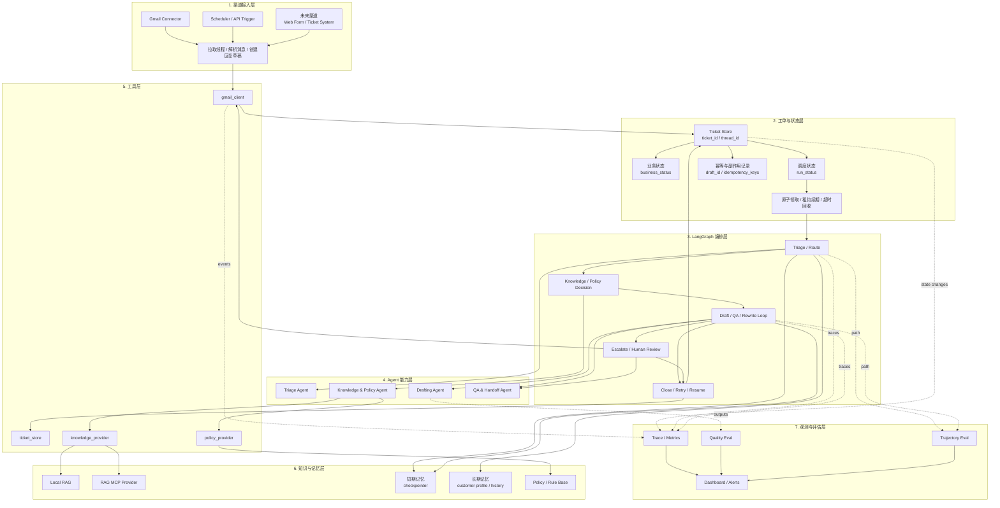
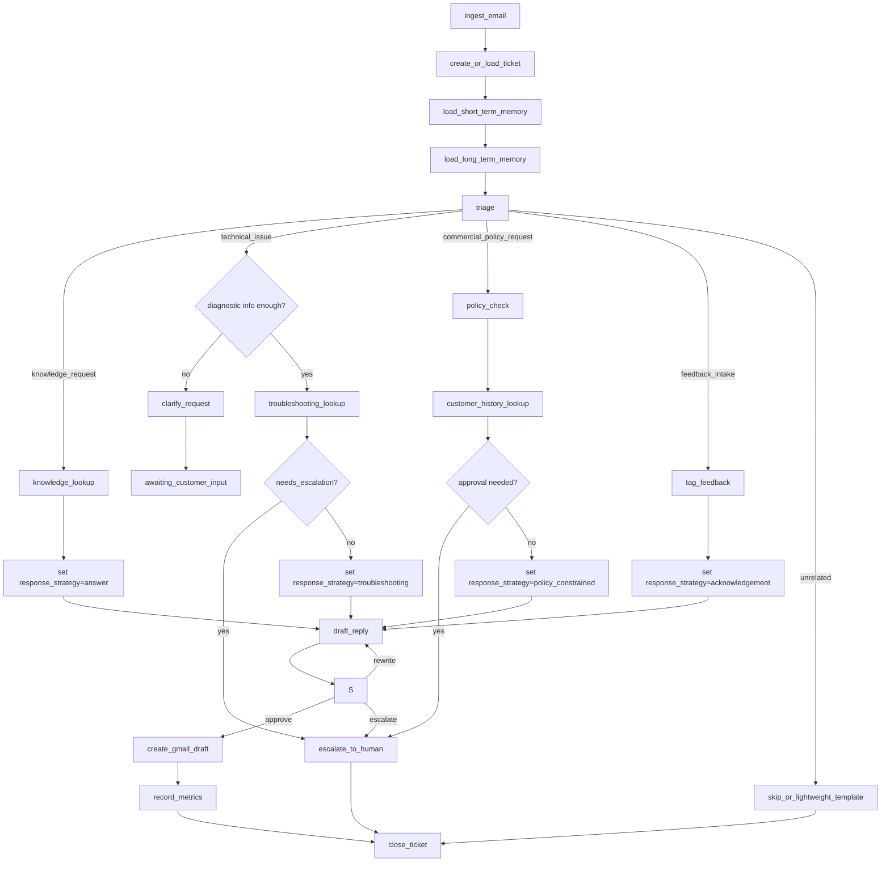
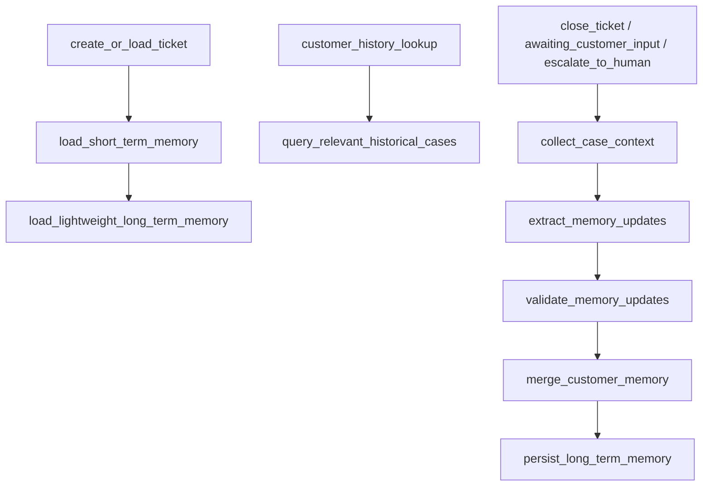

# Customer Support Copilot 技术设计文档

## 1. 文档目标

本文档的目标不是简单罗列技术名词，而是把这个项目的内部工作方式讲清楚，让读者即使不看代码，也能回答下面这些问题：

1. 当前仓库到底怎么运行。
2. LangGraph 图里有哪些节点，它们怎么串起来。
3. 状态对象里有什么字段，它们在流程中怎么变化。
4. Gmail、RAG、Writer、Proofreader 各自承担什么角色。
5. 当前系统为什么还不算“完整的多 Agent 系统”。
6. 扩展后的目标架构应该怎么设计。

这份文档分为两部分：

1. 当前实现说明。
2. 目标技术设计说明。

---

## 2. 当前仓库技术现状

## 2.1 当前目录结构

当前仓库在目录迁移完成后的核心目录如下：

```text
langgraph-email-automation/
├── scripts/
│   ├── run_poller.py
│   ├── serve_api.py
│   └── build_index.py
├── main.py
├── deploy_api.py
├── create_index.py
├── data/
│   └── agency.txt
├── docs/
│   ├── customer-support-copilot-requirements.zh-CN.md
│   └── customer-support-copilot-technical-design.zh-CN.md
└── src/
    ├── agents/
    ├── api/
    ├── db/
    ├── orchestration/
    ├── llm/
    ├── memory/
    ├── prompts/
    ├── rag/
    ├── contracts/
    ├── telemetry/
    ├── tickets/
    ├── tools/
    └── workers/
```

如果用一句话概括各层职责：

1. `scripts/run_poller.py` 负责 Gmail poller 的 `ingest + enqueue` 批处理入口。
2. `scripts/serve_api.py` 负责启动业务 API。
3. `scripts/build_index.py` 负责离线构建本地知识库索引。
4. `main.py`、`deploy_api.py`、`create_index.py` 仅保留兼容包装入口。
5. `src/orchestration/` 定义 LangGraph workflow、状态合同、条件路由与 checkpoint。
6. `src/orchestration/nodes.py` 定义每个节点的执行逻辑。
7. `src/agents/` 和 `src/llm/` 定义角色型 Agent 与统一 LLM runtime。
8. `src/memory/`、`src/rag/`、`src/telemetry/` 分别承载记忆、知识访问与观测评测。
9. `src/tools/` 负责 Gmail API 集成与 provider 抽象。
10. `src/workers/` 负责 worker 领取、续租、恢复与 graph 执行。

---

## 2.2 当前系统如何启动

当前仓库有三个正式启动入口。

### 2.2.1 本地脚本入口 `scripts/run_poller.py`

`scripts/run_poller.py` 当前扮演 Gmail poller：

1. 拉取未处理 Gmail 线程。
2. 将邮件 ingest 为 ticket。
3. 调用 `run_ticket` 只创建 `queued` run。

这里有两个很重要的事实：

1. 当前系统的 Gmail 入口仍是批处理式运行，不是常驻 worker。
2. `scripts/run_poller.py` 不再直接执行 graph。

这意味着：

1. 它适合作为定时任务或手动 poller。
2. 正式执行、lease 与 crash-resume 都由 worker 负责。

### 2.2.2 API 入口 `scripts/serve_api.py`

`scripts/serve_api.py` 当前只负责启动业务 `FastAPI` 应用。

它做的事情有：

1. 读取统一配置。
2. 调用 `src.api.app.create_app()` 构造应用。
3. 通过 `uvicorn` 启动业务 API。

### 2.2.3 Worker 入口 `src/workers/ticket_worker.py`

worker 是当前正式执行 graph 的唯一入口，职责包括：

1. 领取 `queued` run。
2. 续租与失租保护。
3. fresh/resume 决策。
4. 调用 `src.orchestration.workflow.Workflow` 执行 ticket workflow。

说明：

1. 下文 `2.3` 到 `2.10` 保留了早期教程型原型的拆解，主要用于解释重构动机。
2. 当前正式实现与模块落点应以 `src/orchestration/`、`src/agents/`、`src/llm/`、`src/memory/`、`src/rag/`、`src/telemetry/`、`src/evaluation/`、`src/workers/` 以及 `docs/specs/*.md` 为准。

---

## 2.3 当前流程图结构

当前正式 LangGraph workflow 定义在 `src/orchestration/workflow.py`。

### 2.3.1 当前节点列表

图里一共注册了 9 个节点：

1. `load_inbox_emails`
2. `is_email_inbox_empty`
3. `categorize_email`
4. `construct_rag_queries`
5. `retrieve_from_rag`
6. `email_writer`
7. `email_proofreader`
8. `send_email`
9. `skip_unrelated_email`

其中需要特别说明的是：

1. `send_email` 这个节点名字容易误导。
2. 实际上它调用的是 `create_draft_response`。
3. 也就是说主流程默认行为是创建 Gmail 草稿，而不是直接发送邮件。

### 2.3.2 当前边和条件边

当前图的执行结构可以用下面这个简化版本理解：

```text
load_inbox_emails
  -> is_email_inbox_empty
    -> empty   -> END
    -> process -> categorize_email

categorize_email
  -> product related     -> construct_rag_queries
  -> not product related -> email_writer
  -> unrelated           -> skip_unrelated_email

construct_rag_queries
  -> retrieve_from_rag
  -> email_writer
  -> email_proofreader

email_proofreader
  -> send    -> send_email -> is_email_inbox_empty
  -> rewrite -> email_writer
  -> stop    -> categorize_email

skip_unrelated_email
  -> is_email_inbox_empty
```

### 2.3.3 图里最关键的两个机制

#### 机制一：条件路由

当前系统已经使用了 LangGraph 的条件边：

1. 收件箱为空则结束。
2. 收件箱非空则继续处理。
3. 产品咨询走 RAG 分支。
4. 投诉和反馈跳过 RAG，直接写草稿。
5. 无关邮件直接跳过。

#### 机制二：有限循环

当前系统有一个很重要的循环：

1. `email_writer` 生成草稿。
2. `email_proofreader` 审核草稿。
3. 如果不通过，则回到 `email_writer`。
4. 最多重写三次。

这个循环已经体现了 LangGraph 的价值，因为它不是单次调用，而是带条件的重试闭环。

### 2.3.4 当前图的局限

虽然当前图已经有条件边和循环，但还存在明显限制：

1. 没有 supervisor 或 router 节点。
2. 没有专门的人工审核分支。
3. 没有短期和长期记忆节点。
4. 没有可恢复状态持久化。
5. 没有评估与观测节点。

---

## 2.4 当前状态设计

当前正式状态合同定义在 `src/orchestration/state.py`。

### 2.4.1 `Email` 模型

当前每封邮件被建模为一个 `Email` 对象，字段包括：

1. `id`
2. `threadId`
3. `messageId`
4. `references`
5. `sender`
6. `subject`
7. `body`

这几个字段已经足够支撑 Gmail 线程回复：

1. `threadId` 用于把回复挂到原线程。
2. `messageId` 和 `references` 用于构造标准回复头。
3. `sender`、`subject`、`body` 用于生成回复内容。

### 2.4.2 `GraphState` 字段

当前图的共享状态字段如下：

1. `emails`
2. `current_email`
3. `email_category`
4. `generated_email`
5. `rag_queries`
6. `retrieved_documents`
7. `writer_messages`
8. `sendable`
9. `trials`

下面逐个解释这些字段的真实用途。

#### `emails`

待处理邮件列表。

当前系统的处理方式不是从队列里逐条“shift”，而是每次取列表最后一封：

1. `categorize_email` 中会读取 `state["emails"][-1]`。
2. 处理完成后用 `pop()` 把当前邮件移出列表。

这意味着当前系统实际是后进先出处理。

#### `current_email`

当前正在处理的邮件对象。

这个字段在 `categorize_email` 节点里设置，后续节点都基于它工作。

#### `email_category`

分类结果，当前只可能是：

1. `product_enquiry`
2. `customer_complaint`
3. `customer_feedback`
4. `unrelated`

#### `generated_email`

当前草稿正文。

每次 `email_writer` 生成新版本时都会覆盖这个字段。

#### `rag_queries`

如果邮件属于产品咨询，则这里会存最多三个查询问题。

#### `retrieved_documents`

这是一个字符串，而不是结构化文档列表。

当前系统在 `retrieve_from_rag` 中会把每个查询及其回答拼接成一个大字符串，例如：

```text
query 1
answer 1

query 2
answer 2
```

这意味着当前检索结果没有 citation，也没有结构化证据对象。

#### `writer_messages`

这是当前状态里最容易误解的字段。

它并不是正式的记忆系统，而是用来保存当前邮件的改写历史，内容包括：

1. `Draft 1`
2. `Proofreader Feedback`
3. `Draft 2`
4. `Proofreader Feedback`

这个字段的作用只是为 writer 提供当前邮件内的草稿-反馈历史，不应被包装成短期记忆体系。

#### `sendable`

proofreader 的判定结果，表示当前草稿是否通过。

#### `trials`

当前邮件已尝试改写的次数。

每次进入 `write_draft_email` 都会加一。

### 2.4.3 当前状态流转的真实过程

当前一封邮件从进入到结束，大致会触发以下状态变化：

1. `load_new_emails` 更新 `emails`。
2. `categorize_email` 设置 `current_email` 和 `email_category`。
3. `construct_rag_queries` 设置 `rag_queries`。
4. `retrieve_from_rag` 设置 `retrieved_documents`。
5. `write_draft_email` 更新 `generated_email`、`writer_messages`、`trials`。
6. `verify_generated_email` 更新 `sendable` 并继续追加 `writer_messages`。
7. `must_rewrite` 根据 `sendable` 和 `trials` 决定后续路径。
8. `create_draft_response` 成功后把 `retrieved_documents` 清空，并把 `trials` 重置为 0。

### 2.4.4 当前状态设计的不足

如果从系统设计角度看，当前状态结构还有几个明显问题：

1. 没有 `ticket_id`。
2. 没有 `customer_id`。
3. 没有工单状态字段。
4. 没有升级原因字段。
5. 没有质量评分字段。
6. 没有节点延迟、token 使用量等观测字段。
7. 没有短期记忆和长期记忆分层。

---

## 2.5 当前节点逻辑逐个解释

当前节点实现都在 `src/orchestration/nodes.py`。

## 2.5.1 `load_new_emails`

职责：

1. 调用 Gmail 工具拉取待处理邮件。
2. 把原始字典列表转换为 `Email` 对象列表。
3. 写入 `state["emails"]`。

这是图的入口节点。

## 2.5.2 `check_new_emails` 与 `is_email_inbox_empty`

这里其实是两个函数配合使用：

1. `is_email_inbox_empty` 什么都不做，只把状态原样返回。
2. `check_new_emails` 根据 `len(state["emails"])` 判断返回：
   - `empty`
   - `process`

这是一种比较轻量的 LangGraph 用法：

1. 一个节点用于进入条件判断点。
2. 一个函数作为条件边路由器。

## 2.5.3 `categorize_email`

职责：

1. 从 `emails` 列表中取最后一封邮件。
2. 调用分类链。
3. 输出 `email_category` 和 `current_email`。

关键点：

1. 当前系统不是给所有邮件同时分类，而是逐封处理。
2. 当前分类只读取邮件正文 `body`，没有显式利用 `subject` 或历史线程上下文。

## 2.5.4 `route_email_based_on_category`

这是分类后的路由函数，返回三个字符串之一：

1. `product related`
2. `not product related`
3. `unrelated`

这里其实隐含了当前系统的一个简化假设：

1. 只有产品咨询需要知识检索。
2. 投诉和反馈默认不需要知识检索。

这个假设有用，但不够强，因为现实中投诉和退款也常常需要政策信息。

## 2.5.5 `construct_rag_queries`

职责：

1. 读取 `current_email.body`。
2. 调用查询构造链。
3. 写入 `rag_queries`。

这个节点的价值在于：

1. 它没有直接拿邮件正文去检索。
2. 它先把邮件问题“翻译”成更适合检索的问题列表。

## 2.5.6 `retrieve_from_rag`

职责：

1. 遍历 `rag_queries`。
2. 对每个 query 调用 `generate_rag_answer`。
3. 把 query 和 answer 依次拼接成字符串。
4. 写入 `retrieved_documents`。

这里要特别澄清两个点：

1. 当前节点拿到的不是原始 chunk 列表，而是已经生成好的文本回答。
2. 因为回答被拼成大字符串，后续节点无法直接知道某一句话来自哪条证据。

## 2.5.7 `write_draft_email`

职责：

1. 组装一个大字符串输入给 writer。
2. 从状态里读取当前 `writer_messages` 作为历史。
3. 调用 writer 链生成邮件草稿。
4. 递增 `trials`。
5. 把草稿版本追加到 `writer_messages`。

组装输入时，writer 收到的是三块内容：

1. 邮件类别。
2. 客户原始邮件。
3. 检索信息。

如果不是产品咨询，`retrieved_documents` 通常为空字符串。

## 2.5.8 `verify_generated_email`

职责：

1. 把客户原始邮件和生成草稿交给 proofreader。
2. 获取 `send` 与 `feedback`。
3. 把 feedback 追加到 `writer_messages`。
4. 更新 `sendable`。

proofreader 是当前流程里唯一的质量控制节点。

## 2.5.9 `must_rewrite`

这是当前图里最关键的控制逻辑之一。

判断规则如下：

1. 如果 `sendable` 为 `true`：
   - 把当前邮件从 `emails` 中弹出。
   - 清空 `writer_messages`。
   - 返回 `send`。
2. 如果 `sendable` 为 `false` 且 `trials >= 3`：
   - 把当前邮件从 `emails` 中弹出。
   - 清空 `writer_messages`。
   - 返回 `stop`。
3. 否则：
   - 返回 `rewrite`。

这里能看出当前实现的一个重要设计选择：

1. 失败三次后，这封邮件会被直接跳过，不再继续处理。
2. 它不会自动升级给人工。

这正是后续扩展里必须补上的地方。

## 2.5.10 `create_draft_response`

职责：

1. 调用 Gmail API 创建草稿回复。
2. 重置部分状态字段。

当前返回的是：

1. `retrieved_documents = ""`
2. `trials = 0`

注意：

1. 它没有显式清空 `generated_email`。
2. 它也没有记录草稿 ID。
3. 它没有更新工单状态，因为当前系统本来就没有工单状态。

## 2.5.11 `skip_unrelated_email`

职责：

1. 把当前邮件从 `emails` 列表中移除。
2. 返回更新后的状态。

这意味着无关邮件不会被进一步记录或打标签，只是被跳过。

---

## 2.6 原型 Agent 设计

原型阶段的单文件 Agent 实现后来被拆入 `src/agents/`，其最初形态更像 5 条职责明确的 LLM / RAG 链，而不是会互相协作的自治 Agent 团队。

### 2.6.1 模型选择

当前代码里初始化了两类模型：

1. 生成模型曾使用供应商专属 chat SDK。
2. 嵌入模型曾使用供应商专属 embedding SDK。

这类实现的问题是：

1. 配置层直接耦合供应商名称。
2. 切换到 OpenRouter、兼容网关或私有代理时需要改代码。
3. 聊天模型和嵌入模型分别走不同协议，运维面不统一。

当前设计已统一收敛为：

1. 生成模型统一走 OpenAI-compatible chat 协议。
2. 嵌入模型统一走 OpenAI-compatible embeddings 协议。
3. 通过 `LLM_API_KEY`、`LLM_BASE_URL`、`LLM_CHAT_MODEL`、`LLM_EMBEDDING_MODEL` 控制，不在 agent 和 node 中写死具体供应商。

### 2.6.2 分类链

输入：

1. 邮件正文。

输出：

1. `CategorizeEmailOutput`，其中只有一个字段 `category`。

优点：

1. 使用结构化输出，稳定性比纯文本强。

限制：

1. 只有单标签。
2. 没有置信度。
3. 没有多意图表达。

### 2.6.3 RAG 查询生成链

输入：

1. 邮件正文。

输出：

1. `RAGQueriesOutput.queries`，最多三个问题。

它解决的问题是：

1. 客户邮件可能很散。
2. 检索通常更适合使用精炼问题，而不是整封邮件原文。

### 2.6.4 RAG 回答链

当前实现方式是：

1. 用 Chroma 检索 `k=3`。
2. 把检索到的 context 和用户问题注入 prompt。
3. 用 `llama` 输出自然语言答案。

这说明当前 RAG 是“检索增强生成”，不是“检索结果直接回传”。

### 2.6.5 Writer 链

writer 使用 `ChatPromptTemplate.from_messages` 组装：

1. system prompt。
2. `MessagesPlaceholder("history")`。
3. human 输入。

这也是为什么 `writer_messages` 会被传给 writer。

需要注意：

1. 这里的 history 不是完整线程历史。
2. 它只是当前邮件内的草稿与反馈历史。

### 2.6.6 Proofreader 链

proofreader 输出的是 `ProofReaderOutput`，包含：

1. `feedback`
2. `send`

它本质上做了二分类：

1. 通过。
2. 不通过。

但它没有进一步输出：

1. 风险等级。
2. 错误类型。
3. 事实性得分。
4. 风格问题类型。

---

## 2.7 当前 Prompt 设计

Prompt 已按能力拆分到 `src/prompts/` 目录下。

### 2.7.1 分类 Prompt

当前分类 Prompt 的特点是：

1. 角色是 SaaS 客服专家。
2. 规则写得比较明确。
3. 标签空间被强约束在四类。

这对 Demo 阶段是好事，因为：

1. 容易控。
2. 容易展示。

但它也限制了项目深度，因为真实客服邮件经常是：

1. 多意图。
2. 模糊意图。
3. 风险导向。

### 2.7.2 查询构造 Prompt

当前查询构造 Prompt 让模型做的事是：

1. 阅读客户邮件。
2. 抽取主要意图。
3. 生成最多三个适合检索的问题。

这个设计很合理，因为它把“理解邮件”和“检索知识”拆开了。

### 2.7.3 RAG Answer Prompt

这个 Prompt 明确要求：

1. 只能基于给定 context 回答。
2. 如果信息不足，就说 `I don't know.`。

这是当前项目里一个重要的安全边界：

1. 它限制了 hallucination。
2. 也为未来“知识不足时升级人工”留了自然接口。

### 2.7.4 Writer Prompt

当前 writer 会根据不同类别控制语气：

1. `product_enquiry` 偏说明型。
2. `customer_complaint` 偏安抚型。
3. `customer_feedback` 偏感谢型。
4. `unrelated` 偏澄清型。

优点：

1. 很适合早期 Demo。

不足：

1. 没有品牌语气层。
2. 没有限制越权承诺。
3. 没有客户等级或语言偏好。

### 2.7.5 Proofreader Prompt

proofreader 主要检查三件事：

1. 准确性。
2. 语气和风格。
3. 整体质量。

当前好处是：

1. 已经形成“生成-审核-重写”闭环。

当前不足是：

1. 标准偏粗。
2. 不易统计。
3. 无法直接接入评估仪表盘。

---

## 2.8 当前 Gmail 集成设计

Gmail 相关逻辑位于 `src/tools/gmail_client.py`。

## 2.8.1 认证方式

当前使用 OAuth，本地依赖：

1. `credentials.json`
2. `token.json`

作用域是：

`https://www.googleapis.com/auth/gmail.modify`

首次运行时会打开浏览器授权，之后复用 `token.json`。

## 2.8.2 拉取邮件逻辑

当前 `fetch_recent_emails` 只读取最近 8 小时邮件。

Gmail 查询条件是：

1. `after:<timestamp>`
2. `before:<timestamp>`

然后 `fetch_unanswered_emails` 做进一步筛选：

1. 获取最近邮件。
2. 获取所有 Gmail draft。
3. 用 `threadId` 排除已存在草稿的线程。
4. 用 `seen_threads` 保证同一线程只处理一次。
5. 跳过发件人包含自己邮箱地址的邮件。

这套逻辑的实际意义是：

1. 尽量减少重复处理。
2. 把线程而不是单条 message 当作处理单位。

## 2.8.3 邮件正文解析

正文提取流程包括：

1. 优先取 `text/plain`。
2. 如果没有纯文本，则提取 `text/html`。
3. 使用 BeautifulSoup 去掉脚本、样式等标签。
4. 把 HTML 转成可读文本。
5. 最后再做空白字符清洗。

这说明当前项目并不是只适配最理想的纯文本邮件。

## 2.8.4 回复创建方式

当前主流程走的是 `create_draft_reply`。

实现里会：

1. 构造 HTML 邮件。
2. 设置 `In-Reply-To`。
3. 设置 `References`。
4. 保留原 `threadId`。

这几个步骤保证了 Gmail 能把草稿挂回原会话线程。

### 2.8.5 当前 Gmail 集成的优点

1. 真实可运行。
2. 线程回复头处理正确。
3. 已考虑去重和自发件过滤。

### 2.8.6 当前 Gmail 集成的问题

1. 没有系统内工单状态表。
2. 没有草稿与工单的持久绑定关系。
3. 失败后无法正式恢复。
4. 没有人工审批后发送接口。

---

## 2.9 当前 RAG 设计

## 2.9.1 索引构建

`scripts/build_index.py` 负责离线构建知识库。

流程如下：

1. 从 `data/agency.txt` 读取文档。
2. 用 `RecursiveCharacterTextSplitter` 切块。
3. 参数为：
   - `chunk_size = 300`
   - `chunk_overlap = 50`
4. 使用 OpenAI-compatible embeddings 接口向量化。
5. 存入本地 Chroma `db/`。

## 2.9.2 运行期检索

当前正式运行期检索主要落在 `src/rag/local_provider.py`，并由 `src/agents/knowledge_policy_agent.py` 发起：

1. 打开 `persist_directory="db"`。
2. 创建 retriever，`k=3`。
3. 对每个 query 做一次检索增强生成。

## 2.9.3 当前 RAG 的真实边界

当前 RAG 能做的事：

1. 从单一本地文档回答产品问题。
2. 在上下文不足时输出 `I don't know.`。

当前 RAG 不能做的事：

1. 多知识源路由。
2. 插件式外部知识接入。
3. 引用级证据追踪。
4. 检索质量评测。
5. 多轮检索优化。

因此，本项目后续设计里应该把当前 RAG 保留下来，但不要夸大成“已经是成熟知识系统”。

---

## 2.10 当前系统从技术角度最关键的不足

如果从“系统”视角而不是“Demo”视角来评价，当前仓库最关键的技术短板有七个：

1. 没有真正的任务状态持久化。
2. 没有短期和长期记忆分层。
3. 没有更强的意图路由。
4. 没有人工审核闭环。
5. 没有通用运行指标采集。
6. 没有 Agent 结果和轨迹评估。
7. 没有把本地 RAG 抽象成可替换知识访问层。

---

## 3. 目标系统设计

## 3.1 目标系统一句话架构

目标系统是一个以邮件为主入口的多 Agent 客服协同平台，使用 `LangGraph` 进行有状态编排，使用 `LangChain` 统一模型与工具抽象，并在此基础上补齐：

1. 更强的意图路由。
2. 短期与长期记忆。
3. 人工审核与升级。
4. 通用观测指标。
5. Agent 专属评估指标。
6. 可替换的知识访问层。

---

## 3.2 目标架构分层

建议把未来项目拆成七层：

1. 渠道接入层。
2. 工单与状态层。
3. LangGraph 编排层。
4. Agent 能力层。
5. 工具层。
6. 知识与记忆层。
7. 观测与评估层。

### 3.2.1 渠道接入层

当前先保留 Gmail。

职责：

1. 拉取邮件。
2. 解析线程。
3. 创建回复草稿。
4. 未来扩展到其他渠道时保持接口稳定。

### 3.2.2 工单与状态层

职责：

1. 给每个邮件线程分配 `ticket_id`。
2. 维护处理状态。
3. 记录人工审核结果。
4. 提供可恢复性和幂等控制。
5. 提供任务领取、租约续期和超时回收能力。

### 3.2.2.1 为什么工单层必须承担并发控制

如果系统未来以定时任务、API 服务或多 worker 形式运行，至少会遇到以下并发场景：

1. 两个轮询实例同时拉到同一 Gmail 线程。
2. 一个工单被超时重试时，原执行流尚未完全结束。
3. 多个 worker 同时争抢待处理工单。

如果 V2 进一步支持人工审核动作与自动流程并行回写同一工单，还要额外处理人工审核和自动流程同时更新同一工单的问题。

这些问题如果只靠 LangGraph 内存状态处理，会带来三类后果：

1. 同一线程被重复创建草稿。
2. 工单状态被旧流程覆盖。
3. worker 崩溃后任务永久卡在处理中。

### 3.2.2.2 最小实现要求

建议把并发控制的最小实现放在工单与状态层，而不是分散到各个 Agent：

1. 以 `thread_id` 作为外部稳定标识，映射唯一 `ticket_id`。
2. 任务必须持久化到数据库，而不是只保存在运行时列表中。
3. worker 必须先原子领取任务，再进入图执行。
4. 处理中任务必须带租约到期时间，超时后可回收。
5. 对 Gmail draft 等外部副作用必须记录幂等结果。
6. 状态更新必须检查前置状态或版本号。

这里建议明确区分两类状态：

1. 业务状态，例如 `triaged`、`draft_created`、`awaiting_human_review`。
2. 调度状态，例如 `queued`、`processing`、`retry_waiting`。

如果把这两类语义强行塞进同一个字段，后续很容易出现“业务上已经 `draft_created`，但调度上仍显示 `processing`”这种难以解释的冲突。

### 3.2.3 LangGraph 编排层

职责：

1. 定义图节点与边。
2. 决定何时走知识、何时走策略、何时升级人工。
3. 管理重写循环。
4. 管理短期记忆检查点。

### 3.2.4 Agent 能力层

职责：

1. 承担专业化决策。
2. 保持输入输出结构化。
3. 与编排层解耦。
4. 首版先控制在 4 个核心 Agent，避免过度拆分。

### 3.2.5 工具层

职责：

1. 统一封装 Gmail、工单状态读写等外部能力。
2. 统一封装知识访问和策略查询接口。
3. 承接有副作用的外部操作，便于做幂等、审计和重试。
4. 保持 Agent 不直接持有高风险写操作。

最小工具层并不等于完整的通用 tool-calling 平台。

当前阶段更合理的目标是：

1. 先做接口化的外部能力适配层。
2. 由编排层或节点显式调用工具层。
3. 暂不要求 Agent 自主决定调用哪个工具。

这里的“工具层”是逻辑分层，不要求所有实现都物理集中到 `src/tools/` 目录。

### 3.2.6 知识与记忆层

职责：

1. 提供本地 RAG。
2. 预留 `RAG MCP` 插件接口。
3. 管理短期记忆和长期记忆。

### 3.2.7 观测与评估层

职责：

1. 基于 trace 采集全链路运行事件。
2. 汇总延迟与资源消耗。
3. 评估最终响应质量。
4. 评估执行轨迹合理性。

### 3.2.8 系统分层架构图

下面这张图以“系统分层”为主框架，突出三件事：

1. 邮件和外部触发如何进入系统。
2. 工单、并发控制和 LangGraph 编排分别落在哪一层。
3. 知识、记忆、观测如何作为横向能力支撑主流程。



这张图对应的主路径可以概括为：

1. 渠道接入层负责把 Gmail 线程或外部触发转成系统输入。
2. 工单与状态层负责持久化工单、做并发控制并记录副作用。
3. LangGraph 编排层负责决定路由、循环、重试和人工升级。
4. Agent 能力层负责专业化决策，但首版只保留 4 个核心 Agent。
5. 工具层统一封装 Gmail、工单读写、知识访问和策略查询能力。
6. 知识与记忆层为图和 Agent 提供外部知识、短期上下文和长期客户背景。
7. 观测与评估层横向采集全链路轨迹、质量和运行指标。

---

## 3.3 目标目录结构建议

建议未来逐步演进到下面这种结构：

```text
customer-support-copilot/
├── app/
│   ├── api/
│   ├── config/
│   └── services/
├── docs/
├── scripts/
├── src/
│   ├── agents/
│   │   ├── triage_agent.py
│   │   ├── knowledge_policy_agent.py
│   │   ├── drafting_agent.py
│   │   └── qa_handoff_agent.py
│   ├── evals/
│   ├── graph/
│   │   ├── routes.py
│   │   ├── state.py
│   │   └── workflow.py
│   ├── memory/
│   │   ├── long_term.py
│   │   ├── short_term.py
│   │   └── summarizer.py
│   ├── rag/
│   │   ├── local_provider.py
│   │   ├── mcp_adapter.py
│   │   └── provider.py
│   ├── schemas/
│   ├── telemetry/
│   └── tools/
│       ├── gmail_client.py
│       ├── ticket_store.py
│       └── policy_provider.py
└── tests/
```

这样拆分的目的不是“显得工程化”，而是为了让每一层职责都能单独解释。

---

## 3.4 目标多 Agent 设计

首版建议把 Agent 控制在 4 个核心角色内。

这样做的原因是：

1. 当前项目最重要的增量不在于把角色拆得越细越好。
2. 更优先的是把路由、状态、并发控制、幂等、记忆和观测做扎实。
3. 先用 4 个角色把边界讲清楚，后续再按复杂度拆成更细的 Agent，更符合工程节奏。

## 3.4.1 `Triage Agent`

职责：

1. 在固定主路由集合内识别 `primary_route`。
2. 在同一集合内补充 `secondary_routes`。
3. 判断是否属于多意图场景。
4. 判断优先级。
5. 判断是否需要澄清。
6. 判断是否需要升级。

首版建议把主路由固定为以下 5 类：

1. `knowledge_request`
2. `technical_issue`
3. `commercial_policy_request`
4. `feedback_intake`
5. `unrelated`

这里有两个重要约束：

1. `模糊意图` 和 `多意图邮件` 不再作为主路由枚举。
2. 它们分别由 `needs_clarification` 和 `multi_intent` 表达。

建议输出字段：

1. `primary_route`
2. `secondary_routes`
3. `tags`
4. `response_strategy`
5. `multi_intent`
6. `confidence`
7. `priority`
8. `needs_clarification`
9. `needs_escalation`
10. `reason`

建议补充最小判定规则：

1. “怎么用/是否支持/能力边界”优先归入 `knowledge_request`。
2. “已尝试操作但失败/报错/不可用”优先归入 `technical_issue`。
3. “咨询账单或收费规则”“要求退款、撤单、取消订阅”“要求补偿或 SLA 解释”统一归入 `commercial_policy_request`。
4. “要求新增或改动产品能力”“表达评价但未提出明确变更请求”“表达不满或追责”优先归入 `feedback_intake`，再用 `tags` 表达细分语义。
5. `technical_issue` 在诊断信息不足时不改主路由，只把 `needs_clarification` 设为 `true` 并进入 `clarify_request`。

建议标签枚举至少包括：

1. `feature_request`
2. `complaint`
3. `general_feedback`
4. `billing_question`
5. `refund_request`

建议的 `response_strategy` 至少包括：

1. `answer`
2. `troubleshooting`
3. `policy_constrained`
4. `acknowledgement`

## 3.4.2 `Knowledge & Policy Agent`

职责：

1. 判断是否需要知识检索。
2. 生成查询。
3. 访问知识源。
4. 汇总证据。
5. 判断退款、计费、补偿等策略问题。
6. 判断哪些内容模型可以说，哪些不能说。

建议输出字段：

1. `queries`
2. `knowledge_summary`
3. `citations`
4. `knowledge_confidence`
5. `risk_level`
6. `allowed_actions`
7. `disallowed_actions`
8. `policy_notes`

当前阶段说明：

1. 默认知识源仍然是当前本地 Chroma。
2. 未来才扩展到 `RAG MCP`。
3. 如果未来政策复杂度继续升高，再拆成独立 `Policy Agent`。

## 3.4.3 `Drafting Agent`

职责：

1. 整合客户上下文、知识结论和策略约束。
2. 根据 `response_strategy` 生成不同模式的客服草稿。

建议输出字段：

1. `draft_text`
2. `draft_rationale`
3. `applied_response_strategy`

## 3.4.4 `QA & Handoff Agent`

职责：

1. 检查响应质量。
2. 检查证据是否足够。
3. 检查语气、逻辑、合规和风险。
4. 输出重写建议或通过结论。
5. 在需要时决定是否人工接管。
6. 输出升级原因和人工接手说明。

建议输出字段：

1. `approved`
2. `issues`
3. `rewrite_guidance`
4. `quality_scores`
5. `escalate`
6. `reason`
7. `human_handoff_summary`

如果后续质量规则或人工升级流程继续复杂，再拆成独立 `QA Agent` 与 `Escalation Agent`。

---

## 3.5 目标图结构

建议未来图结构按下面思路设计：



这张图只描述主业务流程。

其中：

1. `load_short_term_memory` 和 `load_long_term_memory` 表示记忆在主流程中的触发位置。
2. `customer_history_lookup` 表示在特定决策节点按需读取客户历史。
3. 长期记忆的提取、校验、合并、落库不在主图中展开，而在独立记忆子流程中描述。

下一版本如果支持邮件图片附件，建议仍保持主图稳定，不把图片理解前置到 `triage` 之前，也不为图片单独引入一条预处理子图。

最小实现原则如下：

1. `triage` 继续只消费邮件文本，不读取图片。
2. 邮件接入层仅负责提取图片附件并把引用信息写入状态。
3. 只有在 `knowledge_lookup`、`troubleshooting_lookup`、`policy_check` 这类需要证据解释的节点，才按需调用多模态模型联合理解文本和图片。
4. `draft_reply` 默认消费上游结构化结论，不重复直接读图。
5. `QA & Handoff` 仅在高风险场景，或草稿明确引用图片证据时，再按需复核图片。

### 3.5.1 设计原则

1. 路由应先于写作。
2. 高风险判断应先于自动回复。
3. 知识检索和策略判断在首版可合并为一个 Agent 内的两个子能力。
4. 所有决策都应通过状态对象显式留下痕迹。
5. `technical_issue` 只有在诊断信息不足时才进入 `clarify_request`，而不是把所有技术故障都强制转入澄清。
6. `feedback_intake` 不需要独立的写作节点，应通过统一的 `draft_reply + response_strategy=acknowledgement` 实现。

### 3.5.2 记忆子流程

建议把记忆相关逻辑独立成子流程，而不是全部画进主业务图：



这个设计的好处是：

1. 主图保持可读性，重点仍然是路由、写作、审核和升级。
2. 记忆模块内部可以独立演进，例如同步落库、异步任务、独立 memory service。
3. 后续如果把 `extract_memory_updates` 替换为专门的 LLM node 或 Memory Extraction Agent，不需要改动主流程图。

### 3.5.2 循环设计

建议保留当前“写作-审查-重写”的循环，但要升级为：

1. 每轮草稿和反馈都结构化记录。
2. 达到上限后进入人工升级，而不是直接丢弃。

### 3.5.3 条件边设计

至少应支持以下条件边：

1. 是否空队列。
2. 是否需要澄清。
3. 是否需要知识检索。
4. 是否需要策略检查。
5. QA 是否通过。
6. 是否达到重写上限。
7. 是否需要升级人工。

### 3.5.4 任务领取与执行模型

建议把“发现邮件”和“执行工单”拆成两个阶段。

第一阶段是邮件发现与工单落库：

1. 渠道接入层拉取 Gmail 线程。
2. 以 `channel + thread_id` 作为唯一键创建或更新工单。
3. 如果唯一键冲突，说明该线程已被系统接管，不再重复创建。

第二阶段是 worker 领取与执行：

1. worker 只从持久化任务表读取 `queued` 或 `retry_waiting` 状态的工单。
2. 领取动作必须是原子的，只允许一个 worker 把工单的 `run_status` 改成 `processing`。
3. 领取成功后写入 `claimed_by`、`claimed_at` 和 `lease_until`。
4. 只有领取成功的 worker 才能启动 LangGraph。
5. 图中每个关键节点执行后要把结果持久化，不能只停留在内存状态。

建议的最小领取逻辑可以表达为：

1. 先选择候选工单。
2. 再执行条件更新：只有当前 `run_status` 仍然可领取时才更新为 `processing`。
3. 根据受影响行数判断是否领取成功。

这样做的目的是避免多个 worker 在“都看到了同一条任务”之后同时继续执行。

### 3.5.5 租约与超时回收

仅有 `run_status=processing` 还不够，因为 worker 可能在以下时刻崩溃：

1. 已领取任务但尚未进入图执行。
2. 已创建 Gmail 草稿但还没来得及写回结果。
3. 已写入部分节点结果但未完成整个工单。

因此建议每个处理中工单至少维护：

1. `claimed_by`
2. `claimed_at`
3. `lease_until`
4. `retry_count`
5. `last_error`

回收策略可以采用最小规则：

1. 超过 `lease_until` 仍未续期的工单，允许把 `run_status` 转回 `retry_waiting`。
2. 重试前先检查副作用记录，避免重复创建草稿。
3. 超过最大重试次数后，把业务状态转为 `failed` 或人工升级。

---

## 3.6 目标状态设计

建议把未来状态对象拆成几组语义明确的字段。

### 3.6.1 基础工单字段

1. `ticket_id`
2. `channel`
3. `customer_id`
4. `thread_id`
5. `business_status`
6. `run_status`
7. `version`
8. `created_at`
9. `updated_at`

### 3.6.2 输入内容字段

1. `raw_email`
2. `normalized_email`
3. `attachments`

如果下一版本支持图片附件，建议仍然保持输入字段最小扩展，而不是在状态里提前堆叠复杂视觉中间结果。

最小约束如下：

1. `normalized_email` 继续表示供 `Triage Agent` 使用的文本化输入，不混入图片推理结果。
2. `attachments` 只保存附件元数据和可复用引用，例如 `filename`、`mime_type`、`attachment_id`、`inline` 标记。
3. 图片理解结果优先作为 `Knowledge & Policy Agent` 的临时工作结果进入知识或审核字段，而不是作为新的长期输入真相源。
4. 除非后续确有稳定需求，否则不在这一阶段引入独立 `ocr_text`、`image_summary` 一类全局状态字段。

### 3.6.3 路由字段

1. `primary_route`
2. `secondary_routes`
3. `tags`
4. `response_strategy`
5. `multi_intent`
6. `intent_confidence`
7. `priority`
8. `needs_clarification`
9. `needs_escalation`
10. `routing_reason`

### 3.6.4 知识字段

1. `queries`
2. `knowledge_summary`
3. `retrieval_results`
4. `citations`
5. `knowledge_confidence`

### 3.6.5 记忆字段

1. `thread_summary`
2. `customer_profile`
3. `historical_cases`
4. `memory_updates`

### 3.6.6 草稿与审核字段

1. `draft_versions`
2. `qa_feedback`
3. `applied_response_strategy`
4. `rewrite_count`
5. `approval_status`
6. `escalation_reason`

### 3.6.7 观测字段

1. `trace_id`
2. `trace_events`
3. `latency_metrics`
4. `resource_metrics`
5. `response_quality`
6. `trajectory_evaluation`
7. `extra_metrics`

说明：

1. `trace_events` 用于记录节点、LLM、工具和关键决策事件。
2. `latency_metrics`、`resource_metrics`、`response_quality`、`trajectory_evaluation` 是单次 run 的核心评估聚合结果。
3. `extra_metrics` 用于承载非核心但有价值的补充指标。
4. 这些字段仅用于观测、调试和回归分析，不直接影响主流程执行。
5. 不记录模型原始思维链，只记录结构化判断结果与运行元数据。

### 3.6.8 并发与恢复字段

1. `claimed_by`
2. `claimed_at`
3. `lease_until`
4. `retry_count`
5. `last_error`
6. `side_effect_records`
7. `idempotency_keys`

其中：

1. `version` 用于乐观锁或状态更新校验。
2. `lease_until` 用于判断处理租约是否失效。
3. `side_effect_records` 用于记录外部副作用是否已成功执行，例如 Gmail `draft_id`。
4. `idempotency_keys` 用于跨重试或跨 worker 复用副作用结果。

### 3.6.9 为什么要这样拆

因为面试里最怕的情况是：

1. 所有信息都塞在一个大字典里。
2. 每个节点写什么字段全凭感觉。
3. 最后谁也说不清状态边界。

分组后的好处是：

1. 路由、知识、记忆、审核、观测的边界很清楚。
2. 并发控制、恢复控制和业务状态不会混在一起。
3. 每个 Agent 可以只消费自己需要的状态片段。

---

## 3.7 目标记忆设计

## 3.7.1 短期记忆

短期记忆用于当前工单线程。

建议实现方式：

1. 使用 LangGraph checkpointer。
2. 以 `thread_id` 或 `ticket_id` 为 key。

短期记忆中建议保存：

1. 当前邮件线程摘要。
2. 当前主意图和次意图。
3. 已问过的澄清问题。
4. 已生成草稿版本。
5. QA 反馈。
6. 当前工单状态。
7. 当前节点进度。

## 3.7.2 长期记忆

长期记忆用于客户级连续性。

建议实现方式：

1. Postgres。
2. Redis 加持久化。
3. 或者简单 SQLite 起步也可以，但要明确只是最小实现。

长期记忆中建议保存：

1. 客户画像。
2. 历史工单摘要。
3. 偏好语言。
4. 风险标签。
5. 账户信息。

## 3.7.3 记忆触发与生命周期

建议把记忆的读取和写入拆成三个阶段：

1. 工单初始化阶段：`create_or_load_ticket` 后先加载短期记忆，再加载长期记忆。
2. 节点决策阶段：只有在需要客户历史参与判断的节点，才按需执行 `customer_history_lookup`。
3. 工单收尾阶段：在 `close_ticket` 前生成 `memory_updates`，并写回长期记忆。

这里要避免把“首次加载长期记忆”和“按需查询客户历史”理解为完全重复动作：

1. 首次加载更适合读取轻量背景，例如 `customer_profile`、偏好语言、风险标签。
2. 按需查询更适合读取和当前问题强相关的历史案例，例如退款争议、审批记录、相似历史工单摘要。
3. 小型实现可以在首次加载后缓存长期记忆，再由 `customer_history_lookup` 在缓存结果中二次筛选。
4. 如果长期记忆规模较大，则应把按需查询设计为独立检索，避免把全部历史塞入当前上下文。

## 3.7.4 客户标识归并

长期记忆的前提是存在稳定客户标识。

建议规则：

1. `customer_id` 作为长期记忆主键，不直接使用运行态对象引用。
2. 优先使用明确账号 ID、CRM ID 或外部业务主键。
3. 如果没有账号体系，可以暂时以规范化邮箱地址作为最小实现。
4. 如果同一客户存在多个邮箱地址或别名地址，应提供归并映射表。
5. 如果无法可靠归并，应只使用短期记忆，不写入长期记忆，防止污染客户画像。

## 3.7.5 记忆回写与幂等

建议把长期记忆回写设计为结构化更新，而不是直接覆盖整份客户档案。

最小规则：

1. 每次工单结束时生成 `memory_updates`。
2. 每条更新都带 `ticket_id`、`customer_id`、`updated_at` 和 `source_stage`。
3. 对可追加字段，例如 `historical_cases`，采用 append-only 或带去重键的追加策略。
4. 对可覆盖字段，例如偏好语言、账户信息，采用“新值 + 来源 + 更新时间”的 merge 策略。
5. 对风险标签、价值客户等高影响字段，建议支持人工修正或置信度标记。
6. 同一工单重复执行时，回写逻辑必须幂等，避免多次追加重复历史摘要。

## 3.7.6 示例结构

### 3.7.6.1 `memory_updates` 示例

```json
{
  "ticket_id": "t_20260331_014",
  "customer_id": "cust_1024",
  "source_stage": "close_ticket",
  "updated_at": "2026-03-31T09:40:00+08:00",
  "facts": {
    "preferred_language": "zh-CN",
    "risk_tag_add": [],
    "historical_case_append": {
      "category": "shipping_issue",
      "summary": "Asked for expedited shipping update before renewal date.",
      "outcome": "resolved_with_tracking_explanation"
    }
  }
}
```

### 3.7.6.2 长期记忆示例

```json
{
  "customer_id": "cust_1024",
  "profile": {
    "name": "Li Wei",
    "account_tier": "enterprise",
    "preferred_language": "zh-CN",
    "preferred_tone": "direct"
  },
  "risk_tags": ["refund_dispute_history"],
  "business_flags": {
    "high_value_customer": true
  },
  "historical_cases": [
    {
      "ticket_id": "t_20260320_001",
      "category": "refund_request",
      "summary": "Customer disputed partial refund for delayed delivery.",
      "outcome": "manual_approval_granted"
    },
    {
      "ticket_id": "t_20260331_014",
      "category": "shipping_issue",
      "summary": "Asked for expedited shipping update before renewal date.",
      "outcome": "resolved_with_tracking_explanation"
    }
  ]
}
```

## 3.7.7 V2 长期记忆衰退与归档策略

这一节属于 V2 版本内容，用于解决长期记忆越积越多、旧信息干扰当前决策的问题。

### 3.7.7.1 三种处理方式

建议明确区分：

1. 删除：这条记忆不再作为可用数据存在。
2. 降权：这条记忆仍然保留，但在检索和决策中的影响降低。
3. 归档：这条记忆默认不参与主流程，只在审计、人工排查或特定历史查询时使用。

### 3.7.7.2 典型处理方式

#### A. 删除

适用场景：

1. 明确提取错误。
2. 重复脏数据。
3. 客户要求删除。
4. 隐私或合规要求清理。

建议处理方式：

1. 优先软删除，记录 `deleted_at` 或 `is_deleted=true`。
2. 主流程读取时直接忽略。
3. 审计期结束后再决定是否物理删除。

#### B. 降权

适用场景：

1. 偏好语言。
2. 偏好语气。
3. 旧历史案例。
4. 可能过时但仍有参考价值的信息。

建议处理方式：

1. 为记忆计算 `effective_score` 或等价权重。
2. 读取时按权重排序，而不是无条件注入上下文。
3. 低于阈值的记录不进入默认 prompt，但保留在长期记忆中。

#### C. 归档

适用场景：

1. 很久以前的历史工单摘要。
2. 已过主要使用期的风险标签。
3. 需要保留留痕，但不应继续影响主流程的数据。

建议处理方式：

1. 从活跃客户画像移到 archive/history 表，或设置 `archived_at`。
2. 主流程默认不加载归档数据。
3. 仅在人工排查、审计或特定历史查询时读取。

### 3.7.7.3 按字段类型的默认策略

1. `customer_id`、账号主键、外部 CRM 主键：不做自动时间衰退，只允许覆盖更新。
2. `preferred_language`、`preferred_tone`：允许降权，不建议直接删除。
3. `risk_tags`：建议先降权，再视业务策略归档；不建议无审计地自动删除。
4. `historical_cases`：建议优先做检索降权或归档，而不是直接删除。
5. `high_value_customer` 等高影响字段：应优先由业务系统或人工确认更新，不依赖自动衰退。

### 3.7.7.4 推荐实现

建议把长期记忆拆成两层：

1. `memory_events`：append-only，保留来源事件和历史留痕。
2. `memory_profile`：当前活跃客户画像，用于实际读取和注入上下文。

这样可以做到：

1. 删除、降权、归档都只影响“当前怎么使用”。
2. 原始来源记录仍然可追溯。
3. 高风险记忆的变化具备审计能力。

### 3.7.7.5 一个可行的降权公式

可以把长期记忆有效分数设计为：

```text
effective_score = confidence * importance * recency_decay * confirmation_decay
```

其中：

```text
recency_decay = 0.5 ^ (days_since_last_confirmed / half_life_days)
```

示例：

1. 语言偏好：`half_life_days = 180`
2. 风险标签：`half_life_days = 365`
3. 历史案例：`half_life_days = 90`

### 3.7.7.6 V2 边界说明

V2 引入衰退和归档，不代表首版就必须做复杂的自动清理系统。

最小实现也可以接受：

1. V1 先只做结构化长期记忆和可追溯回写。
2. V2 再加入定时归档、权重计算和阈值过滤。
3. 高影响字段继续保留人工修正入口。

## 3.7.8 面试时的关键解释

必须能清楚解释：

1. 短期记忆是当前工单上下文。
2. 长期记忆是跨工单客户背景。
3. 知识库是所有客户共享的通用知识。

这三者不能混为一谈。

---

## 3.8 目标知识访问设计

## 3.8.1 当前阶段原则

当前阶段不重写 RAG。

这并不意味着不做设计，而是：

1. 保留现有本地 RAG 作为默认实现。
2. 把它抽象成一个知识访问 provider。

## 3.8.2 推荐抽象

建议定义统一接口，例如：

1. `KnowledgeProvider`
2. `LocalRagProvider`
3. `McpKnowledgeProvider`

其中：

1. `LocalRagProvider` 对应当前 `agency.txt + Chroma`。
2. `McpKnowledgeProvider` 对应未来外部知识插件。

## 3.8.3 为什么这样设计

因为你的项目重点不在“这次把 RAG 做到多强”，而在：

1. 图编排。
2. 多 Agent 路由。
3. 记忆分层。
4. 审核与升级。
5. 观测与评估。

所以当前最合理的策略是：

1. 保留已有 RAG，减少无效重构。
2. 给未来知识扩展留出清晰接口。

---

## 3.9 目标人工审核设计

这部分能力属于 V1。V2 主要补充的是人工审核动作与自动流程并发更新同一工单时的冲突控制，而不是把人工审核本身推迟到下一版。

未来建议增加以下状态：

1. `draft_created`
2. `awaiting_human_review`
3. `approved`
4. `rejected`
5. `needs_rewrite`
6. `escalated`
7. `closed`

人工可执行的动作应至少包括：

1. 审核通过。
2. 编辑后通过。
3. 驳回并要求重写。
4. 升级给更高等级支持人员。

这样做的价值是：

1. 系统的终点不再只是“生成一封草稿”。
2. 而是“进入一个可管理、可追踪的人机协作闭环”。

---

## 3.10 目标观测与评估设计

本节定义观测与评估模块的技术方案。该模块的目标是为系统提供稳定的观测、调试和回归对比能力，而不是参与主流程控制。

### 3.10.1 设计目标

本模块必须满足以下目标：

1. 能回答“这次运行慢不慢”。
2. 能回答“这次运行花了多少资源”。
3. 能回答“最终回复质量好不好”。
4. 能回答“这次执行路径对不对”。
5. 评估层不参与主流程决策，不阻塞工单执行。
6. 首版统一采用 trace 驱动，每次 run 对应一个 `trace_id`。
7. 不记录模型原始思维链，只记录可观测事件和结构化结论。

### 3.10.2 设计范围与非目标

首版必须实现以下 4 类核心评估：

1. 延迟评估。
2. 资源评估。
3. 响应质量评估。
4. 轨迹评估。

首版明确不以以下事项为目标：

1. 不使用评估结果在线影响图路由或节点执行。
2. 不将附加指标扩展成复杂的实时控制面。
3. 不采集模型原始思维链。

### 3.10.3 核心评估维度

#### A. 延迟评估

目标：

回答“这次运行慢不慢”。

必须至少记录：

1. 端到端延迟。
2. 节点延迟。
3. 单次模型调用延迟。
4. 单次工具调用延迟。

实现要求：

1. 统一从 trace 的 `start_time` 和 `end_time` 计算。
2. 结果必须能够定位到具体慢节点和慢调用。

#### B. 资源评估

目标：

回答“这次运行花了多少资源”。

必须至少记录：

1. 每次模型调用输入 token。
2. 每次模型调用输出 token。
3. 单次运行总 token 消耗。
4. 模型调用次数。
5. 工具调用次数。

实现要求：

1. 资源统计按单次 run 聚合。
2. 成本估算可以补充，但不作为首版核心实现要求。

#### C. 响应质量评估

目标：

回答“最终回复质量好不好”。

首版至少覆盖以下维度：

1. 相关性。
2. 正确性。
3. 意图一致性。
4. 表达清晰度。

实现要求：

1. 只评最终输出，不评隐藏推理过程。
2. 评分输入至少包括用户原始邮件、最终回复、可用证据摘要和策略约束。
3. 首版建议采用 `LLM-as-a-judge`，输出分数和简短理由。
4. 评分结果只用于观测和回归对比，不直接阻塞流程。

#### D. 轨迹评估

目标：

回答“这次执行路径对不对”。

首版至少覆盖以下维度：

1. 路由是否正确。
2. 节点顺序是否合理。
3. 关键步骤是否缺失。
4. 该转人工时是否正确转人工。

实现要求：

1. 轨迹评估对象是执行路径，不是模型思维链。
2. 通过实际 trace 与理想路径模板比对得出结果。
3. 输出应至少包含实际路径、期望路径和违规点列表。

### 3.10.4 Trace 采集模型

每次 run 都应生成一个 `trace_id`，并在整条执行链路中透传。

Trace 至少采集以下 4 类事件：

1. `node`
2. `llm_call`
3. `tool_call`
4. `decision`

推荐最小字段如下：

1. `trace_id`
2. `ticket_id`
3. `run_id`
4. `event_type`
5. `event_name`
6. `start_time`
7. `end_time`
8. `latency_ms`
9. `status`
10. `metadata`

字段要求如下：

1. `llm_call.metadata` 至少包含 `model`、`prompt_tokens`、`completion_tokens`、`total_tokens`。
2. `tool_call.metadata` 至少包含 `tool_name`、`status` 和输入输出引用。
3. `decision.metadata` 至少包含 `primary_route`、`response_strategy`、`needs_clarification`、`needs_escalation`、`final_action`。

### 3.10.5 核心评估输出结构

单次 run 的核心评估结果至少应聚合为以下对象：

1. `latency_metrics`
2. `resource_metrics`
3. `response_quality`
4. `trajectory_evaluation`

推荐语义如下：

1. `latency_metrics`
   至少包含端到端延迟、节点延迟汇总和关键慢调用定位信息。
2. `resource_metrics`
   至少包含 token 汇总、模型调用次数和工具调用次数。
3. `response_quality`
   至少包含总分、分项分数和简短理由。
4. `trajectory_evaluation`
   至少包含总分、期望路径、实际路径和违规项列表。

### 3.10.6 响应质量评测实现

建议输入：

1. 原始邮件内容。
2. 最终回复内容。
3. 知识摘要或引用证据。
4. 策略约束说明。

建议输出：

1. `response_quality.score`
2. `response_quality.subscores`
3. `response_quality.reason`

建议做法：

1. 首版统一使用 1 到 5 分制。
2. 每个维度单独打分，再汇总总体分。
3. 输出简短判分理由，便于调试和人工抽查。
4. 评分结果只进入报表、回归分析和调试界面，不反向控制流程。

### 3.10.7 轨迹评测实现

首版以规则脚本为主，必要时再用 LLM 辅助解释。

建议输出：

1. `trajectory_evaluation.score`
2. `trajectory_evaluation.expected_route`
3. `trajectory_evaluation.actual_route`
4. `trajectory_evaluation.violations`

首版至少应定义以下理想路径模板：

1. `knowledge_request`：`Triage -> Knowledge/Policy -> Drafting -> QA/Handoff -> 输出`
2. `technical_issue` 且信息不足：`Triage -> Clarify -> 等待补充`
3. `commercial_policy_request` 且高风险：`Triage -> Knowledge/Policy -> Human Handoff`
4. `feedback_intake`：`Triage -> Drafting -> QA/Handoff -> 输出`

常见违规至少包括：

1. 跳过必需节点。
2. 节点顺序错误。
3. 本应转人工却继续自动生成。
4. 本应澄清却直接给出结论。

### 3.10.8 附加指标

以下指标可以补充，但不属于首版核心评估范围：

1. 成本估算。
2. 成功率。
3. 错误率。
4. 平均重写次数。
5. 升级率。
6. 检索命中率。

### 3.10.9 推荐实现方式

建议拆成以下 3 部分实现：

1. Trace 与运行指标。
   使用 LangSmith 或 Langfuse。
2. 响应质量与轨迹评测。
   使用 `LLM-as-a-judge` 加规则脚本。
3. 评估结果聚合。
   按 `trace_id` 汇总成单次 run 的评估结果，并沉淀到 ticket 或运行记录中。

### 3.10.10 设计说明

轨迹评估必须保留，因为仅看最终结果会掩盖很多问题。

例如：

1. 最终回复看上去还行，但其实绕过了政策检查。
2. 最终回复看上去正确，但检索明明失败了却仍然给出了答案。
3. 本来应先升级人工，却错误地走了自动草稿流程。

这些问题只靠最终输出质量评分是发现不了的。

---

## 3.11 目标 API 设计

当前已经有正式业务 API；如果继续扩展系统，重点应放在接口能力深化，而不是回退到 runnable 暴露模式。

### 输入接口

1. `POST /tickets/ingest-email`
2. `POST /tickets/{id}/run`
3. `POST /tickets/{id}/approve`
4. `POST /tickets/{id}/rewrite`
5. `POST /tickets/{id}/escalate`

### 查询接口

1. `GET /tickets/{id}`
2. `GET /tickets/{id}/trace`
3. `GET /customers/{id}/memory`
4. `GET /metrics/summary`

其中建议最小返回语义如下：

1. `GET /tickets/{id}/trace`
   返回某个 ticket 最近一次或指定 run 的 `trace_id`、`trace_events`、`latency_metrics`、`resource_metrics`、`response_quality`、`trajectory_evaluation`。
2. `GET /metrics/summary`
   返回聚合后的主评估指标摘要，至少包括延迟、资源、响应质量、轨迹评估 4 类指标的统计结果。
3. `GET /tickets/{id}`
   除业务状态外，建议附带最近一次运行的评估摘要引用，便于从工单页快速跳转到 trace。

这些接口的价值是：

1. 让系统不再只是一个“图 runnable”。
2. 而是一个真正有业务概念的服务。

---

## 3.12 目标测试设计

建议测试分三层。

### 3.12.1 单元测试

1. 邮件解析。
2. Gmail 去重逻辑。
3. 结构化输出解析。
4. 状态更新函数。

### 3.12.2 集成测试

1. 邮件进入后能否跑到草稿生成。
2. QA 不通过时是否回到重写节点。
3. 知识缺失时是否触发升级。

### 3.12.3 回归评测

使用固定样本测试：

1. 产品咨询。
2. 投诉。
3. 多意图。
4. 需澄清场景。
5. 知识缺失。
6. 高风险退款。
7. “功能建议”和“一般反馈”边界样本。

输出至少应包括：

1. 响应质量结果。
2. 轨迹评估结果。

### 3.12.4 离线预评测入口

首版应明确支持“脱离邮件入口”的离线预评测。

原因：

1. 邮件入口主要负责拉取、去重和工单化，不应成为 Agent 能力验证的唯一入口。
2. 如果每次评测都依赖 Gmail，调试成本高，结果也不稳定。
3. Agent 的主能力本质上是“给定结构化输入后是否能走对路径并产出合理结果”，这可以先在离线样本上验证。

建议做法：

1. 保留 `scripts/run_poller.py` 作为正式本地运行入口，`main.py` 作为兼容包装。
2. 先在文档中定义固定测试样本和字段规范，实现阶段再补离线评测脚本或等价入口。
3. 每条样本映射为统一的 `initial_state`，至少填充 `current_email.subject`、`current_email.body` 及必要元数据。
4. 通过 `Workflow().app` 直接执行图，而不是先经过 Gmail 拉取层。
5. 每次执行都产出 `trace_id`、主路由结果、是否升级、最终回复、响应质量结果、轨迹评估结果。

推荐最小样本结构：

1. `sample_id`
2. `scenario_type`
3. `email_subject`
4. `email_body`
5. `expected_primary_route`
6. `expected_escalation`
7. `reference_answer_or_constraints`
8. `expected_route_template`

推荐最小执行流程：

1. 先准备固定样本集和预期结果。
2. 将样本转换为图状态。
3. 通过 LangGraph runnable 执行单条或批量 run。
4. 汇总主路由、高风险升级、响应质量、轨迹评估和延迟结果。
5. 输出回归报表，并保留单条失败样本对应的 trace。

这意味着系统可以先通过固定测试集预先测试 Agent，再接入真实邮件入口。

建议把邮件入口测试和 Agent 离线评测拆开看：

1. 邮件入口测试验证拉取、去重、解析、工单化是否正确。
2. 离线评测验证路由、升级、草稿生成、QA 和轨迹是否正确。
3. 两者通过后，再做端到端联调。

---

## 4. 从当前仓库到目标系统的演进路径

## 4.1 第一阶段：不推翻，先整理

目标：

1. 保持当前 Gmail 和本地 RAG 可运行。
2. 明确代码目录和状态语义。
3. 增加最小工具层。
4. 接入最基础的 trace 和日志。

建议动作：

1. 拆分 `agents.py` 和 `nodes.py`。
2. 新增 `gmail_client`、`ticket_store`、`knowledge_provider`、`policy_provider`。
3. 新增统一配置层。
4. 引入 trace ID。
5. 增加基础测试。

## 4.2 第二阶段：补齐面试关键能力

目标：

1. 引入 triage 路由。
2. 引入短期记忆和长期记忆。
3. 引入人工审核状态。
4. 引入基于 trace 的核心评估。
5. 把 Agent 首版收敛为 4 个核心角色。

建议动作：

1. 新增 `Triage Agent`。
2. 新增 `Knowledge & Policy Agent`。
3. 新增 `Drafting Agent` 与 `QA & Handoff Agent`。
4. 接 LangSmith 或 Langfuse。
5. 新增 eval 样本集。

## 4.3 第三阶段：形成展示级项目

目标：

1. 项目叙事完整。
2. 演示路径清晰。
3. 失败案例和指标展示齐全。

建议动作：

1. 更新 README。
2. 输出新流程图。
3. 准备 demo case。
4. 准备一次失败案例分析。

---

## 5. 面试时最容易被问到的问题

### 问题 1：为什么用 LangGraph

建议回答：

1. 因为流程有条件路由和循环。
2. 因为不同节点之间要共享状态。
3. 因为后续还要接入记忆和人工中断点。

### 问题 2：为什么这是多 Agent，而不是多个链

建议回答：

1. 当前仓库其实更像多个链。
2. 真正升级后，我把 triage、knowledge、policy、drafting、qa、escalation 做成职责清晰的角色型 Agent。
3. 编排层决定协作顺序，Agent 负责局部专业决策。

### 问题 3：为什么当前不重写 RAG

建议回答：

1. 当前 RAG 已经能支撑产品问答。
2. 项目真正缺的不是检索，而是路由、记忆、审核和评估。
3. 我把 RAG 抽象成 provider，为未来 `RAG MCP` 扩展留接口，而不是现在把重点打散。

### 问题 4：如何衡量这个系统是否真的在变好

建议回答：

1. 不能只看平均延迟。
2. 也不能只看最终回复好不好。
3. 必须同时看延迟、资源、响应质量和轨迹评估。
4. 其中响应质量和轨迹评估用于判断系统是否真正做对了事。

### 问题 5：当前最大技术债是什么

建议回答：

1. 没有任务持久化。
2. 没有记忆分层。
3. 没有人工审核闭环。
4. 没有正式观测与评测。

---

## 6. 当前仓库与目标项目差异

| 维度 | 当前仓库 | 目标项目 |
|---|---|---|
| 定位 | 邮件自动化示例 | 多 Agent 客服协同系统 |
| 编排 | 基础 LangGraph 条件边与循环 | 带路由、记忆、升级、评估的有状态编排 |
| 意图识别 | 四分类 | 5 条主路由 + 标签化细分 + 多意图/澄清分流 |
| 多 Agent | 多个链串联 | 明确角色协作 |
| 记忆 | 当前邮件改写历史 | 短期线程记忆 + 长期客户记忆 |
| 知识 | 单文档本地 RAG | 当前保留本地 RAG，未来接 `RAG MCP` |
| 审核 | Proofreader 二分类 | QA + 人工审核 + 升级 |
| 观测 | 基本无 | trace + 延迟/资源/响应质量/轨迹评估 |
| 可恢复性 | 无正式支持 | 有 ticket 状态和重试机制 |

---

## 7. 结论

当前仓库本身并不差，它已经具备一个好项目最难得的几个基础：

1. 有真实场景。
2. 有真实外部系统。
3. 有 LangGraph 条件边和循环。
4. 有最基础的生成-审核闭环。

但它距离“适合深聊的面试项目”还差最后一层系统化设计。

这个系统化设计不是盲目加功能，而是补对位置：

1. 把分类升级成路由。
2. 把历史消息升级成真正记忆。
3. 把 proofreader 升级成人工审核闭环的一部分。
4. 把 RAG 保持为稳定基础能力，不在本轮分散注意力。
5. 把观测收敛为基于 trace 的四类核心评估。

做到这一步之后，这个项目就能从“跑通了一个 LangGraph Demo”升级成“设计清楚、边界明确、能被深入讨论的个人系统项目”。
