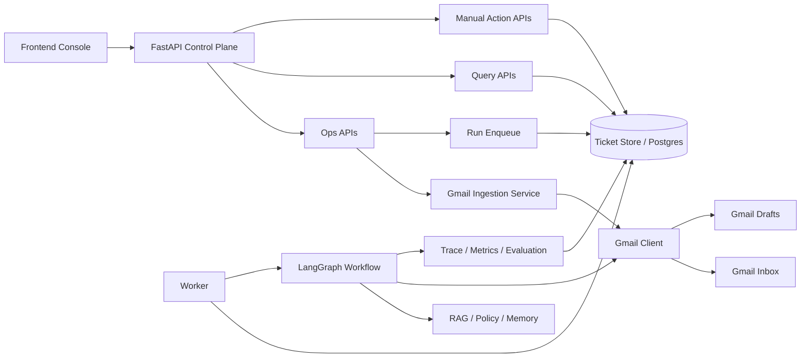

# 前端控制台与后端控制面设计草案

## 1. 文档目标

本文档用于把当前项目从“多个脚本入口 + 后端能力模块”整理为“前端控制台 + 后端控制面 + 异步执行面”的更清晰表达方式。

本文档关注五件事：

1. 解释为什么当前运行方式在展示层面显得分散。
2. 给出适配当前仓库的目标架构，而不是推翻现有 `worker + workflow + Gmail` 设计。
3. 定义一组适合前端控制台消费的后端 API。
4. 说明前端应该具备哪些页面、功能和交互结构。
5. 评估该前端是否能充分展示本项目的功能亮点，以及哪些亮点不能只靠 UI “完美表达”。

---

## 2. 现状与问题

当前仓库的核心能力已经比较完整：

1. `FastAPI` 提供工单接入、执行、查询与人工动作接口。
2. `run_poller.py` 负责 Gmail 扫描、邮件摄入与 run 入队。
3. `run_worker.py` 负责 claim queued run、续租 lease、执行 LangGraph workflow。
4. `src/orchestration/`、`src/agents/`、`src/evaluation/`、`src/telemetry/` 提供 Agent 编排、草稿生成、评估与 trace 能力。

但当前项目的“使用入口”仍然是面向开发者脚本：

1. `python serve_api.py`
2. `python run_worker.py`
3. `python run_poller.py`

这在工程上没有问题，但在产品表达上存在三个明显问题：

1. 用户看到的是多个运行脚本，而不是一套统一系统。
2. Gmail 扫描、ticket 入队、worker 执行、trace 查询分散在不同入口，认知负担较高。
3. 项目亮点虽然很多，但缺少一个统一控制台去把“接入、执行、草稿、人工协同、评估观测”串起来展示。

因此，更合适的表达方式不是削减现有能力，而是把它们收敛到一个统一控制面。

---

## 3. 目标设计原则

目标架构遵循以下原则：

1. 前端只做控制台，不直接持有 Gmail OAuth，也不直接调用 Gmail API。
2. Gmail 接入、ticket 生命周期、run 入队、worker 执行、trace 记录都留在后端。
3. API 继续保持“入队”和“查询”职责，不把 LangGraph 执行改成同步请求。
4. `worker` 继续作为正式执行入口，保留 lease、checkpoint、恢复、幂等等机制。
5. 前端展示的主数据源应是本地 ticket/run/draft/trace 数据，而不是 Gmail 本身。

一句话概括：

> 前端负责操作和观测，后端负责接入和执行。

---

## 4. 目标架构

### 4.1 逻辑分层

目标系统分为三层：

1. 前端控制台
2. 后端控制面 API
3. 后端执行面

其中：

1. 前端控制台只调用 API。
2. 后端控制面 API 负责触发 Gmail 扫描、测试邮件导入、run 入队、人工动作、数据查询。
3. 后端执行面继续由 `worker`、`workflow`、`Gmail client`、`trace/eval` 组成。

### 4.2 目标运行图

### 4.3 对当前仓库的映射

该目标架构不要求推倒重来，而是基于当前代码重组控制入口：

1. `serve_api.py` 继续作为业务 API 入口。
2. `run_worker.py` 继续作为执行面入口。
3. `run_poller.py` 的逻辑下沉为可复用后端服务，并保留为兼容脚本入口。
4. `src/tools/gmail_client.py` 继续作为 Gmail 适配层。
5. `src/workers/runner.py` 和 `src/workers/ticket_worker.py` 继续作为异步执行主路径。

---

## 5. 后端控制面 API 设计草案

## 5.1 可直接复用的现有 API

当前已有的 API 已经能支撑控制台的核心流程：

| 类型 | 接口 | 用途 |
| --- | --- | --- |
| 接入 | `POST /tickets/ingest-email` | 手动注入邮件为 ticket |
| 入队 | `POST /tickets/{ticket_id}/run` | 为 ticket 创建 queued run |
| 查询 | `GET /tickets/{ticket_id}` | 查看 ticket、latest run、latest draft |
| 查询 | `GET /tickets/{ticket_id}/trace` | 查看 trace、latency、resource、评估结果 |
| 人工动作 | `POST /tickets/{ticket_id}/approve` | 审批草稿 |
| 人工动作 | `POST /tickets/{ticket_id}/edit-and-approve` | 编辑后审批 |
| 人工动作 | `POST /tickets/{ticket_id}/rewrite` | 人工要求重写 |
| 人工动作 | `POST /tickets/{ticket_id}/escalate` | 升级到人工队列 |
| 人工动作 | `POST /tickets/{ticket_id}/close` | 关闭 ticket |

这些接口已经覆盖了项目的大部分业务闭环。

## 5.2 建议新增的控制面 API

为了让前端真正成为统一入口，建议增加以下接口：

| 类型 | 接口 | 用途 |
| --- | --- | --- |
| 运维操作 | `POST /ops/gmail/scan` | 手动触发一次 Gmail 扫描、摄入与入队 |
| 运维操作 | `GET /ops/status` | 返回 Gmail 开关、最近扫描时间、最近扫描结果、worker 心跳、系统依赖状态 |
| Ticket 列表 | `GET /tickets` | 支持分页、状态过滤、路由过滤、时间过滤 |
| Ticket 运行历史 | `GET /tickets/{ticket_id}/runs` | 展示一个 ticket 的所有 run 及状态 |
| 草稿版本 | `GET /tickets/{ticket_id}/drafts` | 展示草稿版本、QA 状态、Gmail draft id |
| 调试注入 | `POST /dev/test-email` | 不经过 Gmail，直接注入一封测试邮件并可选自动入队 |
| 失败恢复 | `POST /tickets/{ticket_id}/retry` | 显式触发失败工单重跑 |
| 扫描预览 | `POST /ops/gmail/scan-preview` | 只查看预计会 ingest 的邮件，不落库、不入队 |

## 5.3 接口行为建议

新增接口应遵循以下行为约束：

1. `POST /ops/gmail/scan` 只触发扫描与入队，不等待 `worker` 执行完成。
2. `GET /ops/status` 返回适合前端直接展示的摘要，而不是原始内部对象。
3. `POST /dev/test-email` 支持三种模式：
   1. 仅落 ticket
   2. 落 ticket 后自动入队
   3. 落 ticket、入队并标注为测试数据
4. `GET /tickets/{ticket_id}/drafts` 以本地 `draft_artifacts` 为主视图，并附带 `gmail_draft_id`。
5. `GET /tickets/{ticket_id}/runs` 应明确区分自动 run 与人工动作 run。

## 5.4 推荐落点

建议在当前目录结构中新增如下实现位置：

1. `src/api/services/gmail_ops.py`
2. `src/api/services/ticket_listing.py`
3. `src/api/services/runtime_status.py`
4. `src/api/routes_ops.py`
5. `src/api/routes_tickets.py`

如果暂时不希望拆分路由文件，也可以先继续集中在 `src/api/routes.py`，但应尽早分离“业务动作”和“运维控制”两类路由。

---

## 6. 前端功能设计草案

前端控制台建议覆盖以下六类功能。

## 6.1 总览 Dashboard

Dashboard 用于回答三个问题：

1. 系统现在是否处于可运行状态。
2. 最近进入系统的 ticket 和 run 发生了什么。
3. 最近的响应质量、轨迹评分和耗时表现如何。

建议展示：

1. Gmail 是否启用
2. 最近扫描时间和最近扫描结果
3. worker 是否在线
4. `queued / running / waiting_external / completed / error` 数量
5. 最近 24 小时平均 `response_quality`
6. 最近 24 小时平均 `trajectory_score`
7. 最近 24 小时 `p50 / p95` 延迟

## 6.2 Ticket 列表页

列表页是控制台的主入口，建议支持：

1. 按 `business_status` 过滤
2. 按 `processing_status` 过滤
3. 按 `primary_route` 过滤
4. 按是否有草稿过滤
5. 按是否待人工审核过滤
6. 按关键字搜索客户、主题、ticket id

每条 ticket 卡片或表格行建议展示：

1. `ticket_id`
2. 客户邮箱或客户标识
3. 邮件主题
4. 主路由
5. 业务状态
6. 处理状态
7. 最新 run 状态
8. 是否已有草稿
9. 最后更新时间

## 6.3 Ticket 详情页

Ticket 详情页应成为控制台的核心页面，建议包含五个分区：

1. 基本信息
2. 消息线程
3. 草稿与人工动作
4. 执行轨迹
5. 评估与观测

### 6.3.1 基本信息区

展示：

1. `ticket_id`
2. 客户标识
3. 优先级
4. 主路由与多意图标记
5. 当前业务状态
6. 当前处理状态
7. 当前 claim 信息
8. `current_run_id`

### 6.3.2 消息线程区

展示：

1. 客户最近来信
2. 历史 inbound / outbound message log
3. thread 级上下文
4. 是否来自 Gmail 或测试注入

### 6.3.3 草稿与人工动作区

展示：

1. 最新草稿内容
2. 历史草稿版本
3. `qa_status`
4. `gmail_draft_id`
5. 审批、编辑审批、重写、升级、关闭按钮

这一部分是最能体现“自动草稿 + 人工协同”的页面。

## 6.4 Trace 与评估页

这是本项目与一般邮件自动回复 demo 区分度最高的页面之一。

建议展示：

1. run 时间线
2. 节点级 trace events
3. 每个节点的输入输出摘要
4. `latency_metrics`
5. `resource_metrics`
6. `response_quality`
7. `trajectory_evaluation`
8. 最终动作 `final_action`

建议前端把 trace 页面做成“时间线 + 指标卡 + JSON 抽屉”的结构，而不是只丢一大段原始 JSON。

## 6.5 Gmail 控制页

该页面负责“把 Gmail 接入这件事产品化”。

建议支持：

1. 手动触发扫描
2. 查看最近扫描结果
3. 查看本次扫描新建了多少 ticket
4. 查看哪些线程因已有草稿而被跳过
5. 查看 Gmail 是否启用以及当前账号摘要

## 6.6 测试实验页

这个页面对本地演示、答辩和面试非常重要。

建议支持：

1. 直接粘贴一封测试邮件
2. 选择是否立即入队
3. 选择期望场景标签，例如产品咨询、技术问题、退款计费、高风险升级
4. 一键跳转到对应 ticket 详情页
5. 展示最终路由、草稿、trace 和评估

该页面可以极大降低“必须接真实 Gmail 才能演示”的门槛。

---

## 7. 前端页面形态建议

前端不需要做成营销站，而应做成面向操作与观测的控制台。

推荐的页面结构如下：

1. 左侧固定导航
2. 中间主内容区
3. 右侧上下文详情抽屉或侧栏

推荐的一级导航：

1. `Dashboard`
2. `Tickets`
3. `Gmail Ops`
4. `Trace & Eval`
5. `Test Lab`
6. `System Status`

### 7.1 Dashboard 大致样子

推荐布局：

1. 顶部是运行状态卡片
2. 中间是 ticket/run 趋势图
3. 底部是最近异常 run、待人工审核 ticket、最近扫描结果

### 7.2 Ticket 详情页大致样子

推荐布局：

1. 顶部摘要条显示状态、路由、优先级、运行状态
2. 左栏显示消息线程和客户信息
3. 中栏显示草稿版本与人工动作区
4. 右栏显示 trace 摘要、质量评分、轨迹评分、资源消耗

### 7.3 Trace 页大致样子

推荐布局：

1. 顶部显示本次 run 总结
2. 中间为纵向时间线
3. 底部用表格展示全部事件
4. 复杂输入输出折叠到抽屉中

这种结构更容易把“Agent workflow 是如何执行的”直观看出来。

---

## 8. 该前端能展示哪些项目亮点

该控制台能够较强地展示以下亮点：

| 项目亮点 | 是否适合前端展示 | 展示方式 |
| --- | --- | --- |
| Ticket 化接入 | 是 | Gmail 扫描页、测试实验页、ticket 列表 |
| API 入队 + Worker 异步执行 | 是 | Dashboard、ticket 详情、run 历史 |
| LangGraph 节点编排 | 是 | Trace 时间线、节点视图 |
| 多阶段草稿生成与 QA | 是 | 草稿区、人工动作区、评估区 |
| Gmail draft 创建 | 是 | 草稿列表、`gmail_draft_id`、Gmail Ops |
| 人工审核与升级 | 是 | Approve / Rewrite / Escalate 按钮与状态流转 |
| Response Quality 评估 | 是 | 评分卡、子维度说明、原因摘要 |
| Trajectory Evaluation | 是 | 预期路径 vs 实际路径、违规项列表 |
| Metrics / Trace 观测 | 是 | 时间线、耗时、token、LLM call 指标 |
| 长期记忆 / 客户画像 | 部分适合 | ticket 详情补充 customer memory 摘要 |

---

## 9. 是否能够“完美展示”该项目的所有功能亮点

结论：不能仅靠前端“完美展示”所有亮点，但可以覆盖绝大多数对外可见能力。

原因如下：

### 9.1 能很好展示的部分

前端能够非常好地展示这些内容：

1. 系统不是同步接口，而是工单异步执行系统。
2. workflow 不是单次 LLM 调用，而是多节点、多决策路径。
3. 结果不是一段回复，而是草稿、升级、关闭、澄清等多种动作。
4. 系统具备 trace、metrics、质量评估和轨迹评估。
5. 系统支持人工审批和自动流程协作。

### 9.2 无法只靠 UI 完美表达的部分

以下亮点即使前端做得很好，也仍然无法仅靠界面“完整证明”：

1. lease 续租与失租保护
2. checkpoint 恢复机制
3. Gmail draft 幂等等副作用控制
4. worker 并发 claim 的正确性
5. 人工动作与自动流程同时修改 ticket 时的冲突控制
6. 测试隔离、容器注入、fake provider 等工程质量

这些内容更适合通过以下方式补充展示：

1. `trace` 页面里的事件标签
2. “Run 恢复记录”或“故障回放”面板
3. 文档中的架构说明
4. 测试截图或测试报告
5. 面试演示时的脚本化场景回放

因此，更准确的说法不是“前端能完美展示所有亮点”，而是：

> 前端控制台能完整展示本项目的大多数业务与可观测性亮点，但对可靠性、恢复性和并发一致性的工程亮点，仍需结合 trace 细节、测试与文档一起表达。

---

## 10. 推荐实施顺序

为了降低重构成本，建议按以下顺序推进。

### 10.1 第一阶段：后端控制面收敛

目标：

1. 将 `run_poller.py` 逻辑下沉为后端 service
2. 提供 `POST /ops/gmail/scan`
3. 提供 `GET /ops/status`
4. 提供 `GET /tickets/{ticket_id}/drafts`
5. 提供 `GET /tickets/{ticket_id}/runs`

### 10.2 第二阶段：前端最小控制台

目标：

1. Dashboard
2. Ticket 列表
3. Ticket 详情
4. Trace 查看
5. 手动 Gmail 扫描按钮

### 10.3 第三阶段：测试实验页

目标：

1. 注入测试邮件
2. 自动跳转 ticket
3. 对比不同 route 的处理结果
4. 把演示体验从“命令行 + curl”提升为“控制台操作”

### 10.4 第四阶段：可靠性展示增强

目标：

1. 增加 worker 心跳
2. 增加最近恢复记录
3. 增加失败 run 重试入口
4. 在 trace 页面显式显示 checkpoint / resume / lease 事件

---

## 11. 结论

对于当前项目，最合适的前端化方式不是做一个“直接接 Gmail 的网页客户端”，而是做一个“统一控制台”：

1. 前端只负责发命令、看状态、做人工协同。
2. 后端继续负责 Gmail 接入、ticket 状态机、run 入队、worker 执行、trace 和评估。
3. `worker`、`workflow`、`Gmail client`、`trace/eval` 等现有核心模块应继续保留。

如果该方案落地，项目的外部表达会从：

> 多个脚本入口 + 一组 API

变成：

> 一个前端控制台 + 一个后端系统 + 一个异步执行面

这会让项目的架构边界、演示路径和产品感知都明显更清晰。
