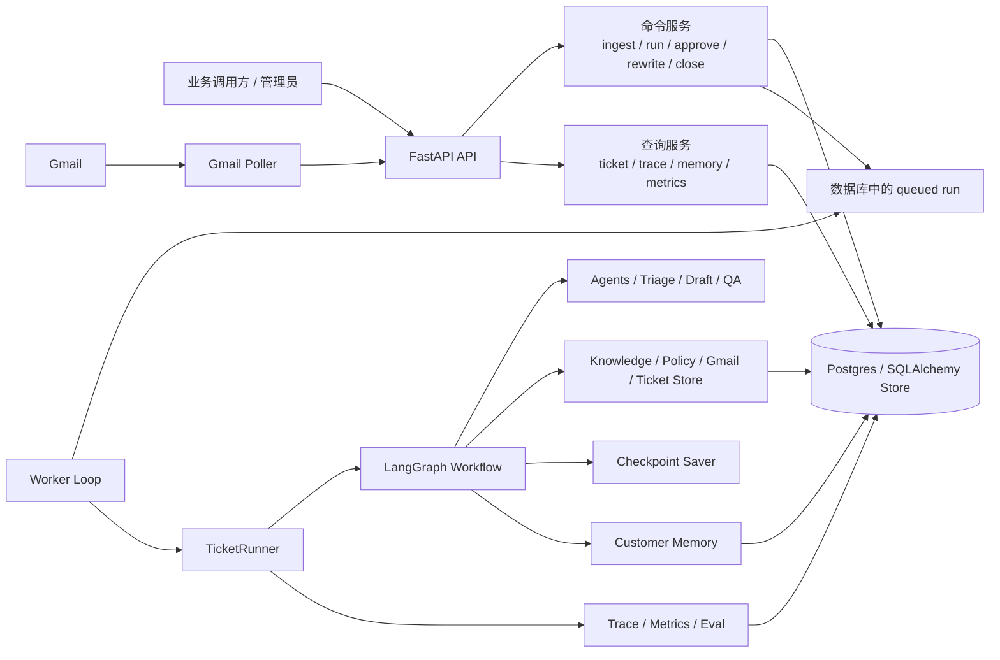
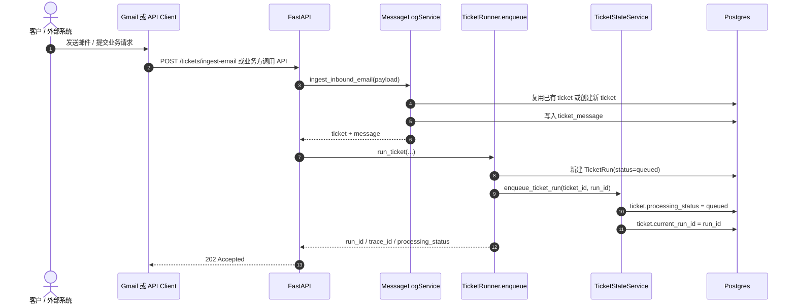
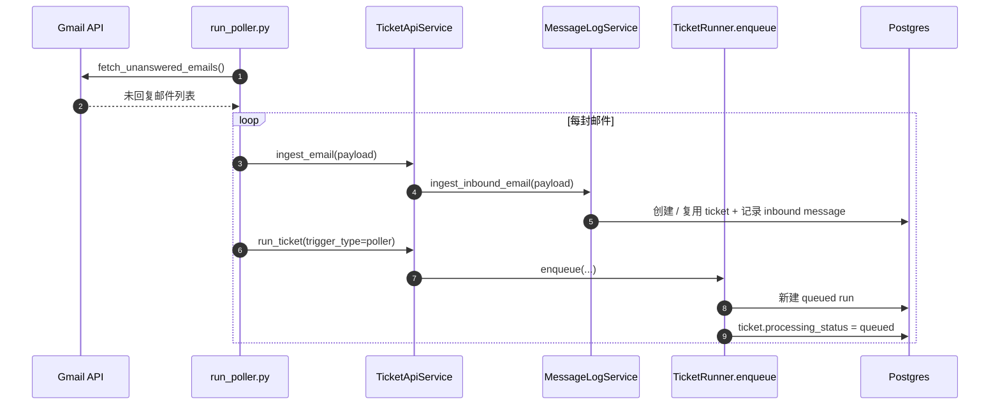
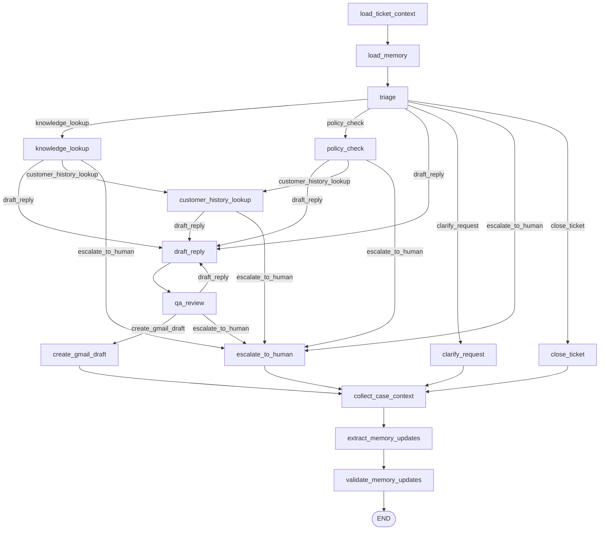
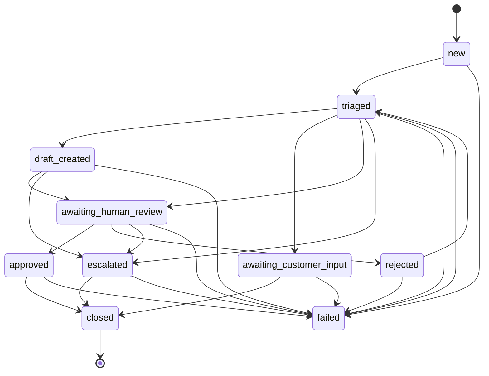
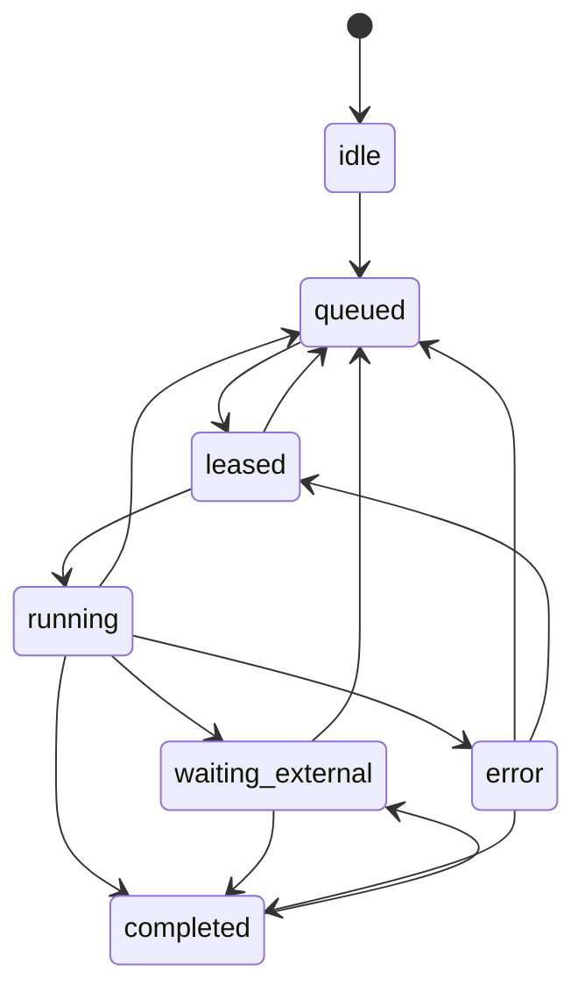
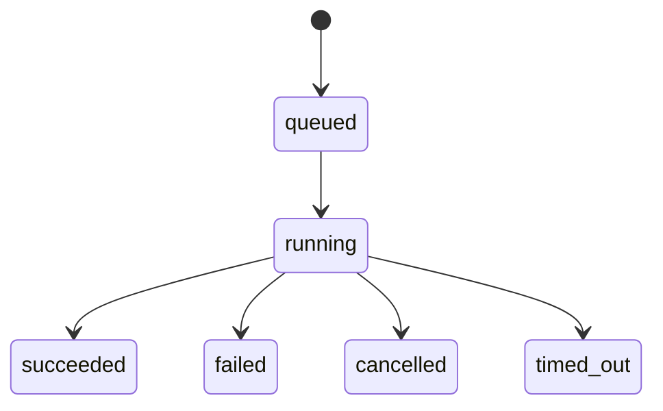
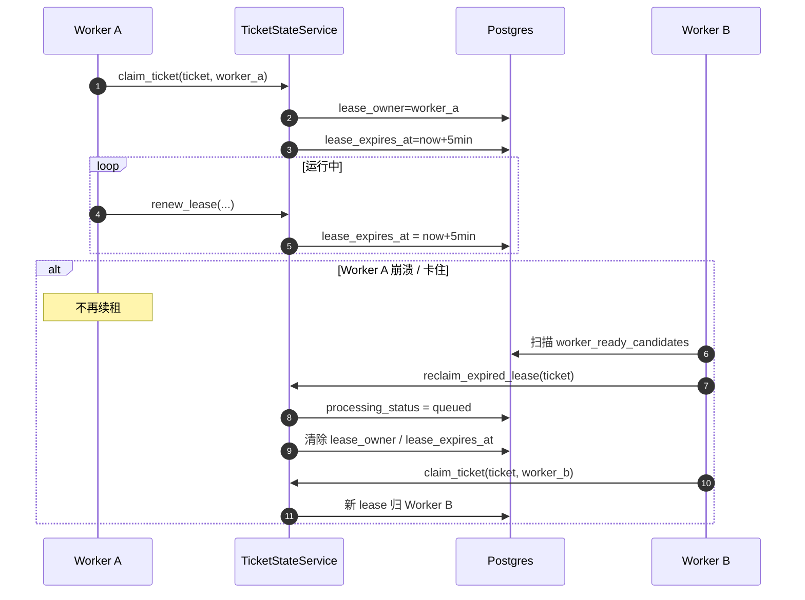
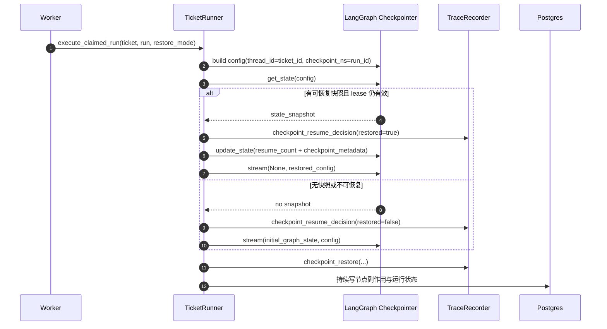
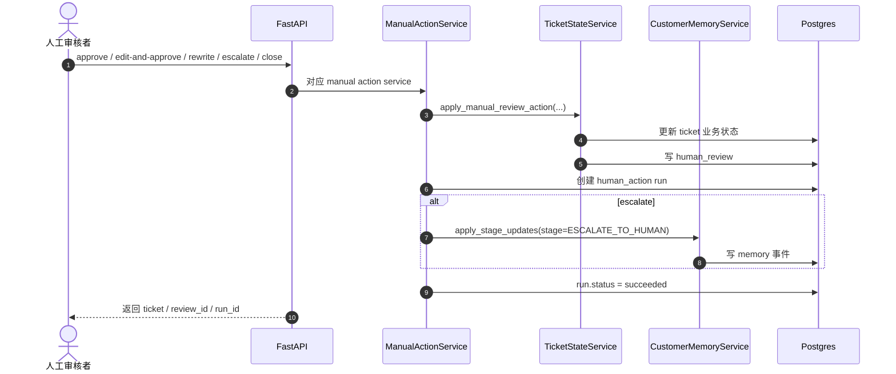

# 项目流程图与时序图导读

这份文档把项目里最值得理解的运行链路整理成一组 `Mermaid` 流程图 / 时序图，方便你从“系统怎么跑起来”一路看到“worker 怎么执行、失败后怎么恢复、人工动作怎么接回流程”。

建议阅读顺序：

1. 先看“系统总览”，建立模块分工。
2. 再看“邮件 / API 到入队”，理解为什么 `run` 是 enqueue-only。
3. 再看“worker 执行主链路”和“LangGraph 节点图”，理解真正的业务执行。
4. 最后看“租约 / checkpoint / 人工动作”，理解恢复、并发控制和人工介入。

相关代码入口：

- `serve_api.py`
- `run_poller.py`
- `run_worker.py`
- `src/api/services/commands.py`
- `src/api/services/manual_actions.py`
- `src/workers/ticket_worker.py`
- `src/workers/runner.py`
- `src/orchestration/workflow.py`
- `src/tickets/state_machine.py`
- `src/orchestration/checkpointing.py`

## 1. 系统总览



这张图重点看三件事：

- API 负责“接请求、落库、入队、人工动作”，不负责正式跑 workflow。
- worker 是唯一正式执行 LangGraph 的进程。
- 数据库既是业务状态存储，也是队列、租约、trace、memory 的中心。

## 2. 邮件 / API 到入队



你从这张图可以理解：

- `POST /tickets/{ticket_id}/run` 的语义是“创建并排队 run”，不是“立刻执行”。
- message log 和 run 是两条并行但相关的记录：前者存消息事实，后者存执行事实。
- API 的事务边界主要围绕“落库 + 入队 + 幂等”。

## 3. Gmail Poller 批处理链路



这张图帮助你理解：

- poller 不做 claim、续租、执行，只负责“拉邮件 + 入队”。
- 邮件采集和 workflow 执行解耦，所以 poller 慢 / 快不会直接影响 worker 语义。
- `trigger_type=poller` 只是 run 的来源标记，不改变 worker 主流程。

## 4. Worker 执行主链路

```mermaid
sequenceDiagram
    autonumber
    participant Loop as run_worker.py
    participant Worker as TicketWorker
    participant State as TicketStateService
    participant Runner as TicketRunner
    participant Workflow as LangGraph Workflow
    participant Checkpoint as Checkpointer
    participant DB as Postgres

    Loop->>Worker: run_once()
    Worker->>DB: list_worker_ready_candidates()

    alt 找到可执行 ticket
        Worker->>State: claim_ticket(ticket_id, worker_id, run_id)
        State->>DB: processing_status = leased
        State->>DB: lease_owner / lease_expires_at

        Worker->>State: start_run(...)
        State->>DB: processing_status = running
        Worker->>Runner: execute_claimed_run(...)

        Runner->>Checkpoint: build_checkpoint_config(ticket_id, run_id)
        Runner->>Workflow: workflow.app.stream(...)

        loop 每轮节点推进
            Workflow->>DB: 读写 ticket / draft / trace / memory
            Runner->>State: renew_lease() [每 60 秒左右]
            State->>DB: 延长 lease_expires_at
        end

        alt 执行成功
            Runner->>DB: run.status = succeeded
            Runner->>DB: 写 response_quality / trajectory_evaluation
        else 执行异常或失租
            Runner->>State: fail_run(...)
            State->>DB: processing_status = error
            State->>DB: 清理 lease
            Runner->>DB: run.status = failed
        end
    else 没有候选任务
        Worker-->>Loop: return None
    end
```

这张图是理解 worker 的核心：

- 先 claim，再 start，再执行；不是直接拿到 queued 就跑。
- lease 是 worker 的并发控制手段。
- `TicketRunner` 负责把“状态机 + workflow + trace + checkpoint”串成一次 run。

## 5. LangGraph 节点工作流

这个图基本对应 `src/orchestration/workflow.py` 里的正式图定义。



这张图帮你看清几个关键分叉：

- `triage` 决定第一跳：知识、政策、直接草稿、澄清、升级、关闭。
- `qa_review` 决定最后出口：通过则建 Gmail draft，不通过则回写重草或升级。
- 所有收尾动作最后都会统一进入 memory 更新链路。

## 6. Ticket 业务状态机



你可以借这张图理解“业务意义”：

- `triaged` 表示已经被系统理解过、可以继续执行。
- `awaiting_customer_input` / `awaiting_human_review` / `escalated` 都属于“等待外部世界”的业务状态。
- `failed` 不是终态，允许重试回到 `triaged`。

## 7. Ticket 处理状态机



这张图用来理解“系统执行语义”：

- `processing_status` 是 worker / 队列维度，不等于业务结果。
- 一个 ticket 可以业务上是 `awaiting_human_review`，处理上却已经 `completed`。
- `queued -> leased -> running` 体现了 worker 的抢占式模型。

## 8. Run 生命周期



可以把 `run` 理解成一次执行尝试：

- `ticket` 是工单实体。
- `run` 是某次驱动该工单向前推进的执行记录。
- 人工动作也会生成自己的 `run`，只是不会走完整 worker 工作流。

## 9. 租约、续租、失租恢复



这张图最适合解释：

- 为什么这个项目不需要外部锁服务。
- 为什么 worker 能水平扩展：靠的是 lease，而不是“只有一个 worker”。
- 为什么崩溃恢复后能继续执行：先回收 lease，再重新 claim。

## 10. Checkpoint 断点恢复



理解这张图以后，你会明白：

- checkpoint 的粒度是 `ticket_id + run_id`，不是仅按 ticket。
- 同一个 ticket 的不同 run 不会互相覆盖短期运行态。
- “重试”和“恢复”不是一回事：恢复是接着原 run 跑，重试通常是新 run。

## 11. 人工动作链路



这张图说明：

- 人工动作不是直接改几列字段，而是走统一状态机。
- 人工动作也会生成 `run`，方便 trace、审计和指标对齐。
- 这部分与 worker 并列存在，属于“人工驱动的状态推进”。

## 12. 结果产物沉淀图

```mermaid
flowchart TD
    Run[一次 TicketRun] --> Ticket[Ticket 状态更新]
    Run --> Trace[Trace Events]
    Run --> Metrics[Latency / Resource Metrics]
    Run --> Eval[Response Quality / Trajectory Evaluation]

    WorkflowEnd[工作流收尾节点] --> Draft[Draft Artifact / Gmail Draft]
    WorkflowEnd --> MessageLog[Ticket Message Log]
    WorkflowEnd --> Memory[Customer Memory Updates]

    Ticket --> QueryAPI[GET /tickets/{id}]
    Trace --> QueryAPI2[GET /tickets/{id}/trace]
    Metrics --> QueryAPI3[GET /metrics/summary]
    Memory --> QueryAPI4[GET /customers/{customer_id}/memory]
```

这张图适合建立“系统输出”的概念：

- 这个项目不只是生成一段回复文案。
- 每次 run 还会沉淀 trace、metrics、evaluation、memory。
- 所以它本质上是“可追踪的工单执行系统”，不只是 demo agent。

## 13. 推荐你按这几个问题去看代码

如果你是第一次读这个仓库，最值得带着下面这些问题去看：

1. **为什么 API 不直接执行 workflow？**
   - 看 `src/api/services/commands.py`
   - 看 `src/workers/ticket_worker.py`

2. **worker 怎么防止多个实例同时处理一张 ticket？**
   - 看 `src/tickets/state_machine.py`
   - 重点看 claim / renew / reclaim / _assert_valid_lease

3. **LangGraph 的真正节点和边在哪里定义？**
   - 看 `src/orchestration/workflow.py`
   - 看 `src/orchestration/routes.py`

4. **为什么崩了还能恢复？**
   - 看 `src/workers/runner.py`
   - 看 `src/orchestration/checkpointing.py`

5. **系统最后到底留下哪些业务痕迹？**
   - 看 `trace_event`、`draft_artifact`、`ticket_message`、`customer_memory` 相关模型与 service

## 14. 一句话理解整个项目

你可以把它概括成：

> 一个以 `ticket` 为中心、以数据库状态机为队列和并发控制、以 `worker + LangGraph` 为执行引擎、以 `trace / memory / evaluation` 为观测与沉淀层的客服工单自动化系统。
